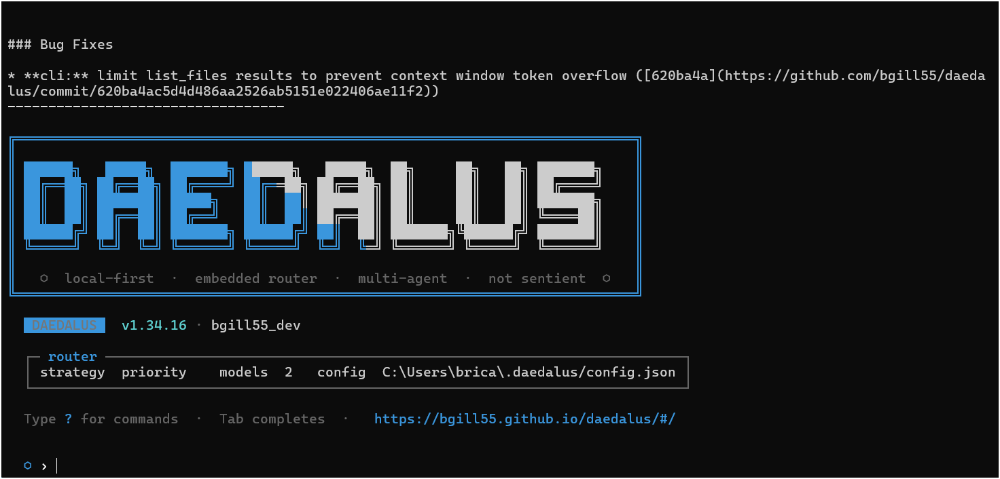
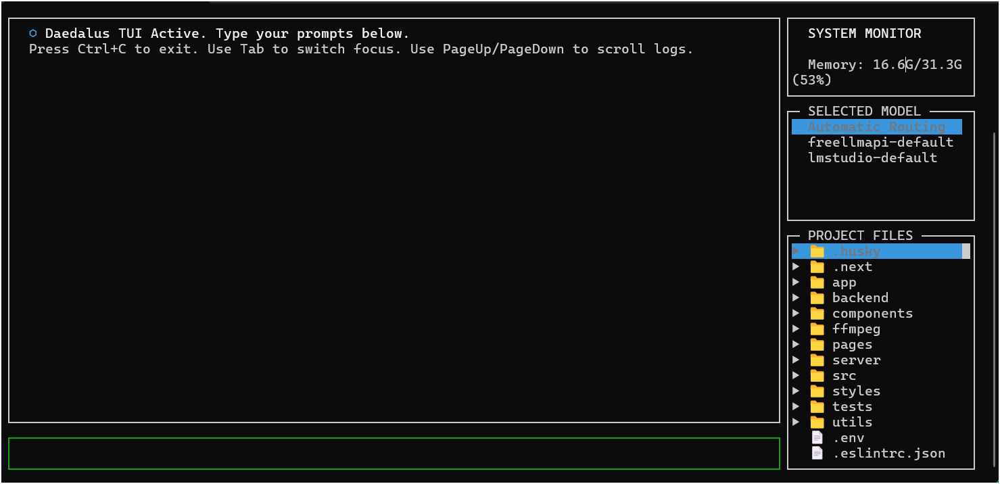

# Daedalus

<p align="center">
  
</p>

<p align="center">
  <a href="https://www.npmjs.com/package/daedalus-cli"></a>
  <a href="https://www.npmjs.com/package/daedalus-cli"></a>
  <a href="https://www.npmjs.com/package/daedalus-cli"></a>
  <a href="https://github.com/bgill55/daedalus/stargazers"></a>
  <a href="https://github.com/bgill55/daedalus/actions/workflows/ci.yml"></a>
  <a href="https://bgill55.github.io/daedalus/"></a>
  <a href="LICENSE"></a>
  <a href="https://nodejs.org"></a>
</p>

**Local-first terminal-based AI coding assistant.**

Daedalus connects to local LLM servers (LM Studio, Ollama, llama.cpp, vLLM) or remote providers (OpenAI, Groq, OpenRouter, Anthropic), routes requests across models, and gives your AI agent access to your file system, terminal, git, web search, and codebase indexing.

For full guides, configuration reference, and examples, visit the documentation site: [https://bgill55.github.io/daedalus/](https://bgill55.github.io/daedalus/)

```text
╔═══════════════════════════════════════════════════════════════════╗
║  ██████╗  █████╗ ███████╗██████╗  █████╗ ██╗     ██╗   ██╗███████╗║
║  ██╔══██╗██╔══██╗██╔════╝██╔══██╗██╔══██╗██║     ██║   ██║██╔════╝║
║  ██║  ██║███████║█████╗  ██║  ██║███████║██║     ██║   ██║███████╗║
║  ██║  ██║██╔══██║██╔══╝  ██║  ██║██╔══██║██║     ██║   ██║╚════██║║
║  ██████╔╝██║  ██║███████╗██████╔╝██║  ██║███████╗╚██████╔╝███████║║
║  ╚═════╝ ╚═╝  ╚═╝╚══════╝╚═════╝ ╚═╝  ╚═╝╚══════╝ ╚═════╝ ╚══════╝║
║                                                                   ║
║  o  local-first · embedded router · multi-agent · not sentient o  ║
╚═══════════════════════════════════════════════════════════════════╝
```

<p align="center">
  
  
</p>

<p align="center">
  <video src="docs/images/Daedalus__Local-First_AI.mp4" width="100%" controls></video>
</p>

---

## Quick Start

```bash
npm install -g daedalus-cli
daedalus
```

To launch with the interactive terminal dashboard layout:
```bash
daedalus --tui
```

On first run, Daedalus scans for local LLM servers and guides you through setup. If none are found, it prompts for a remote provider.

From source: `git clone https://github.com/bgill55/daedalus.git && cd daedalus && npm install && npm run build`

---

## Why Daedalus?

AI assistance without:
- Sending your code to third-party servers
- Per-token pricing for every interaction
- Being locked into a single provider
- Losing conversation history between sessions

---

## Features

### Core
- **Interactive Terminal Dashboard (TUI)** — premium side-by-side dashboard with real-time CPU/RAM monitor gauges, model selection overrides, and an interactive file tree to toggle prompt context dynamically.
- **Local-first** — works entirely on your machine with local LLMs
- **Embedded model router** — priority, round-robin, or fastest-response routing across multiple models
- **Smart model tier routing** — routes planning, reviews, and context summarization calls to your configured `intelligence` tier model
- **Multi-agent orchestration** — spawns planner, coder, reviewer, debugger, and researcher sub-agents
- **Autonomous Finn Loop** — interactive requirements gathering (`/spec`), GitHub Issues tracking, background daemon execution (`daedalus --loop`), and Discord PR review webhook embeds.
- **Loop Engineering & Self-Repair** — automatic stack-aware compile/build verification checks (e.g., `npx tsc --noEmit`, `cargo check`, `go build`) with dynamic stdout/stderr feedback loops for self-repair, and **Automated Workspace Rollback** to revert patches and keep files clean upon task failure.
- **Codebase indexing** — FTS5-powered symbol search, definitions, and call-graph references (TS/JS, Python, Go, Rust)
- **Stack-aware prompting** — automatically scans your project tech stack on startup to prevent library and platform boundary hallucinations
- **Dynamic task checklist** — injects the active todo list into each prompt turn to maintain execution context
- **Session management** — SQLite-backed history with save, load, JSONL export
- **Persistent memory** — facts and coding conventions auto-inject every turn; `/profile` and `/style` persist across sessions
- **Cursor & Claude Code Compatibility** — automatically detects and inherits instructions from `CLAUDE.md`, `.cursorrules`, and `.daedalusrules` files in the project root on startup.
- **MCP support** — Model Context Protocol servers via stdio and HTTP/SSE
- **Windows + Unix** — full cross-platform support

### Tools
- **File tools** — read, write, patch with interactive diff UI; fuzzy whitespace matching, syntax validation with auto-revert
- **Trust layer** — write-without-read guardrail, circuit breaker, import/export validation, auto-test loop, large-rewrite annotation
- **Terminal** — cross-platform shell execution (bash/cmd/powershell) with custom preference support, timeout, and abort
- **Git** — status, diff, stage-all-and-commit, undo
- **Web** — DuckDuckGo search and URL fetching (no API key needed)
- **Codebase** — index, find, definitions, references

### Commands

<!-- START_COMMANDS_TABLE -->
| Command | Description |
|---------|-------------|
| `/add` | Add file to context |
| `/remove` | Remove file from context |
| `/context` | Show active file context |
| `/paste` | Paste clipboard text/image as message |
| `/clear` | Clear conversation history |
| `/system` | Print the current active system prompt (including loaded rules) |
| `/spawn [--bg] <role> <task>` / `/delegate` | Spawn sub-agent: /spawn [--bg] <role> <task> |
| `/tasks` | List background agent tasks |
| `/task <id>` | Manage background task: /task <id> | /task kill <id> |
| `/orchestrate <goal>` / `/orc` / `/run` / `/o` | Orchestrate agents for a goal |
| `/memory` | View project memory (facts & conventions) |
| `/fact [text]` | Add a project fact to memory |
| `/convention [text]` | Add a project convention to memory |
| `/extract` | Manually extract facts from session |
| `/profile` | View or set user profile info |
| `/style` | Set your coding style preferences |
| `/undo` | Undo last file patch |
| `/branch [name]` | Git branch operations |
| `/pr [base]` | Generate PR description Compared to base branch |
| `/debug <command>` | Run command and autonomously debug failures |
| `/ensemble <goal>` | Ensemble model drafting pipeline |
| `/commit [msg]` | Stage and commit changes |
| `/project [set <key> = <val>]` | View or set project config settings (.daedalusrc) |
| `/session [name]` | Manage chat sessions — /session new to start, /session load <id> to restore, /session export [path] to save transcript |
| `/test [n]` | Run test loop and fix failures |
| `/index` | Index codebase for symbol search |
| `/find <query>` | Search indexed symbols |
| `/refs <symbol>` | Find symbol references (callers) |
| `/def <symbol>` | Get symbol definition |
| `/changelog` | View the latest CLI changes |
| `/models` | List available and healthy models |
| `/config [set <key> = <val>]` | Show current configuration |
| `/doctor` | Diagnose connection and discovery |
| `/spec` | Flesh out a feature idea into a GitHub Issue spec (Finn Loop) |
| `/help` / `?` / `help` | Show available commands |
| `/mcp` | Manage MCP servers: explore, search, install, list, remove, info |
| `/onboard` | First-time setup — discover local models, configure, and test |
| `/tui` | Toggle the Terminal User Interface (TUI) dashboard |
| `exit` / `/exit` / `/quit` / `quit` | Save session and exit |
<!-- END_COMMANDS_TABLE -->

Tab completion works on all commands.

---

## Configuration

Daedalus stores config at `~/.daedalus/config.json`. Key sections:

```json
{
  "router": {
    "strategy": "priority",
    "chain": [
      { 
        "name": "local", 
        "endpoint": "http://localhost:1234/v1", 
        "model": "auto", 
        "enabled": true, 
        "priority": 1,
        "supportsTools": true,
        "tier": "intelligence"
      }
    ]
  },
  "indexing": { "enabled": true, "watch": true, "exclude": ["node_modules", "dist", ".git"] },
  "tools": { "sandbox": "none", "sandboxImage": "node:20" }
}
```

Router strategies: `priority` (default), `round-robin`, `fastest`.

Per-project config is stored at `~/.daedalus/config/<project-hash>.json` and can be set via `/project set <key> <value>`.

---

## Detailed Documentation Guides

For in-depth explanations, configuration options, and hardware optimization tips, see the modular guides below:

*   [Model Routing & Tuning Guide](docs/routing-and-tuning.md) — Endpoints, failover chains, routing strategy configs, and GPU/LM Studio tuning recommendations.
*   [Multi-Agent Orchestration](docs/orchestration.md) — Overview of the planning, coding, and review loops, recovery checkpoints, and background task runners.
*   [Autonomous Finn Loop](docs/finn-loop.md) — Interactive requirements specification, GitHub issue tracking, background daemon execution, and Discord webhook notifications.
*   [Execution Sandboxing](docs/sandboxing.md) — Running commands inside isolated Docker containers or WSL distributions.
*   [Model Context Protocol (MCP) Integration](docs/mcp.md) — Configuring stdio and HTTP/SSE servers to expand your agent's capabilities.
*   [Configuration Reference Guide](docs/configuration-reference.md) — Reference list of all global configuration keys (`router.*`, `agents.*`, `tools.*`, `ui.*`, etc.).

---

## Development

```bash
npm run dev       # hot-reload
npm run build     # compile TypeScript
npm test          # vitest (270+ tests)
npm run lint      # eslint (flat config)
npx tsc --noEmit  # type check
```

### Architecture

<p align="center">
  
</p>

```
src/
├── index.ts           CLI entry, REPL, command dispatch
├── config/            Zod-schema validated config
├── router/            Model routing, health checks, rate limiter
├── session/           SQLite sessions, project memory, JSONL export
├── agents/            Multi-agent orchestration (planner, coder, et al.)
├── tools/             16 built-in tools + MCP transport
├── indexing/          FTS5 codebase indexing
└── onboarding/        Setup wizard
```

---

## Contributing

See [CONTRIBUTING.md](CONTRIBUTING.md) for guidelines, coding standards, and the PR process. Governed by the [Code of Conduct](CODE_OF_CONDUCT.md).

---

<p align="center">
  <sub>Daedalus is open source and free. If it helps you build cooler things faster, consider buying me a coffee! ☕</sub>
</p>

<p align="center">
  <a href="https://github.com/bgill55"></a>&emsp;<a href="https://buymeacoffee.com/bgill55art"></a>
</p>

<p align="center">
  <a href="CHANGELOG.md">CHANGELOG.md</a> | <a href="SECURITY.md">SECURITY.md</a> | <a href="LICENSE">MIT License</a>
</p>
