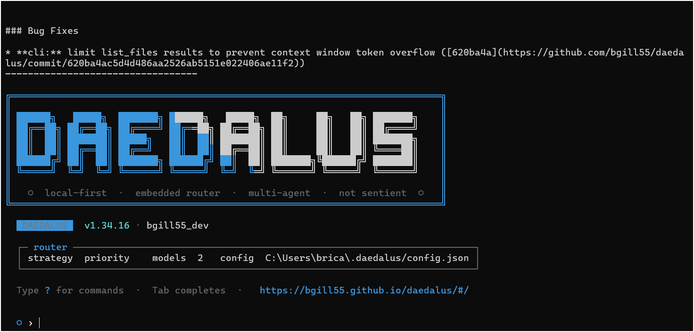
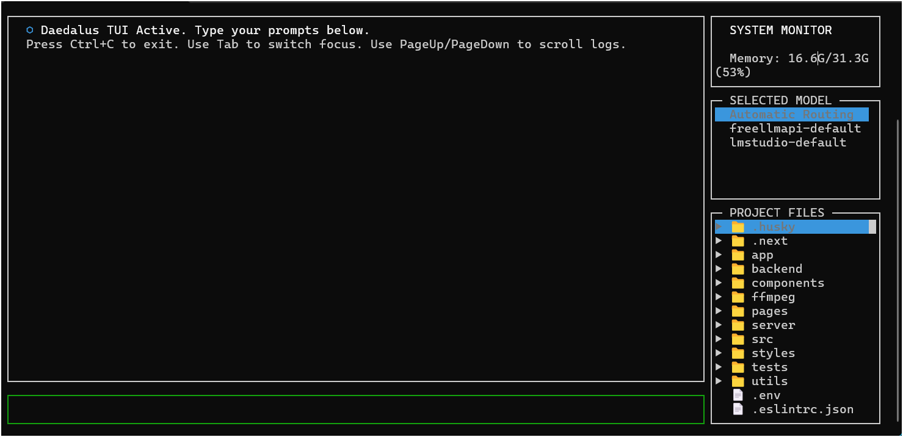
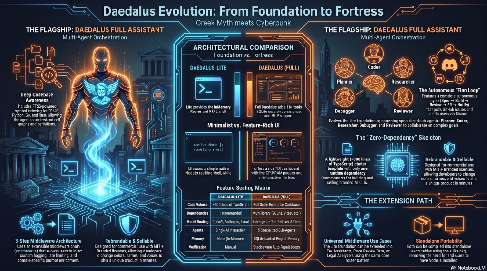

# Daedalus

<p align="center">
  
</p>

<p align="center">
  <a href="https://www.npmjs.com/package/daedalus-cli"></a>
  <a href="https://www.npmjs.com/package/daedalus-cli"></a>
  <a href="https://www.npmjs.com/package/daedalus-cli"></a>
  <a href="https://github.com/bgill55/daedalus/stargazers"></a>
  <a href="https://discord.gg/GPH2ZH57up"></a>
  <a href="https://github.com/bgill55/daedalus/actions/workflows/ci.yml"></a>
  <a href="https://bgill55.github.io/daedalus/"></a>
  <a href="LICENSE"></a>
  <a href="https://nodejs.org"></a>
</p>

**Local-first terminal-based AI coding assistant.**

Daedalus connects to local LLM servers (LM Studio, Ollama, llama.cpp, vLLM) or remote providers (OpenAI, Groq, OpenRouter, Anthropic), routes requests across models, and gives your AI agent access to your file system, terminal, git, web search, and codebase indexing.

For full guides, configuration reference, and examples, visit the documentation site: [https://bgill55.github.io/daedalus/](https://bgill55.github.io/daedalus/)

```text
╔═══════════════════════════════════════════════════════════════════╗
║  ██████╗  █████╗ ███████╗██████╗  █████╗ ██╗     ██╗   ██╗███████╗║
║  ██╔══██╗██╔══██╗██╔════╝██╔══██╗██╔══██╗██║     ██║   ██║██╔════╝║
║  ██║  ██║███████║█████╗  ██║  ██║███████║██║     ██║   ██║███████╗║
║  ██║  ██║██╔══██║██╔══╝  ██║  ██║██╔══██║██║     ██║   ██║╚════██║║
║  ██████╔╝██║  ██║███████╗██████╔╝██║  ██║███████╗╚██████╔╝███████║║
║  ╚═════╝ ╚═╝  ╚═╝╚══════╝╚═════╝ ╚═╝  ╚═╝╚══════╝ ╚═════╝ ╚══════╝║
║                                                                   ║
║  o  local-first · embedded router · multi-agent · not sentient o  ║
╚═══════════════════════════════════════════════════════════════════╝
```

<p align="center">
  
  
</p>

<p align="center">
  <video src="docs/images/Daedalus__AI_Coding_Assistant.mp4" width="100%" controls></video>
</p>

---

> ### Looking to build and sell your own AI CLI?
> Check out **[Daedalus-Lite](https://bgill55.github.io/daedalus-lite/)** — the zero-dependency, rebrandable TypeScript starter template designed for developers to build, rebrand, and sell their own custom AI coding tools! [Visit Daedalus-Lite →](https://bgill55.github.io/daedalus-lite/)
> 
> **Fun fact**: Daedalus itself was built using Daedalus-Lite as a starting point, then extended with advanced features like multi-agent orchestration, codebase indexing, and autonomous workflows. See [what's possible with Daedalus-Lite](https://bgill55.github.io/daedalus-lite/#what-is-possible) for inspiration.

---

## Quick Start

```bash
npm install -g daedalus-cli
daedalus
```

To launch with the interactive terminal dashboard layout:
```bash
daedalus --tui
```

On first run, Daedalus scans for local LLM servers and guides you through setup. If none are found, it prompts for a remote provider.

From source: `git clone https://github.com/bgill55/daedalus.git && cd daedalus && npm install && npm run build`

---

## Why Daedalus?

AI assistance without:
- Sending your code to third-party servers
- Per-token pricing for every interaction
- Being locked into a single provider
- Losing conversation history between sessions

---

## Features

### Core
- **Interactive Terminal Dashboard (TUI)** — premium side-by-side dashboard with real-time CPU/RAM monitor gauges, model selection overrides, and an interactive file tree to toggle prompt context dynamically.
- **Local-first** — works entirely on your machine with local LLMs
- **Embedded model router** — priority, round-robin, or fastest-response routing across multiple models with real-time tokens-per-second (`tok/s`) stream telemetry, plus **Multi-Model Fallback** for zero-interruption auto-failover on rate limits (429) or 5xx errors.
- **Smart model tier routing** — routes planning, reviews, and context summarization calls to your configured `intelligence` tier model
- **Multi-agent orchestration** — spawns planner, coder, reviewer, debugger, and researcher sub-agents
- **Autonomous Finn Loop** — interactive requirements gathering (`/spec`), GitHub Issues tracking, background daemon execution (`daedalus --loop`), and Discord PR review webhook embeds.
- **Loop Engineering & Self-Repair** — automatic stack-aware compile/build verification checks (e.g., `npx tsc --noEmit`, `cargo check`, `go build`) with dynamic stdout/stderr feedback loops for self-repair, **Automated Workspace Rollback** to revert patches upon task failure, and **Git-Aware Smart Testing (`/test -g`)** to run only affected unit tests in < 200ms.
- **Codebase indexing & Live Watcher** — FTS5-powered symbol search, definitions, and call-graph references across 10+ languages with background **Live File-Watcher (`/watch`)** for automatic re-indexing on save.
- **MCP Marketplace & Explorer (`/mcp explore`)** — Model Context Protocol server marketplace with one-click installation (`/mcp install <name>`) via stdio and HTTP/SSE.
- **Stack-aware prompting** — automatically scans your project tech stack on startup to prevent library and platform boundary hallucinations
- **Dynamic task checklist** — injects the active todo list into each prompt turn to maintain execution context
- **Session management** — SQLite-backed history with save, load, JSONL export
- **Persistent memory** — facts and coding conventions auto-inject every turn; `/profile` and `/style` persist across sessions
- **Cursor & Claude Code Compatibility** — automatically detects and inherits instructions from `CLAUDE.md`, `.cursorrules`, and `.daedalusrules` files in the project root on startup.
- **MCP support** — Model Context Protocol servers via stdio and HTTP/SSE
- **Windows + Unix** — full cross-platform support

### Tools
- **File tools** — read, write, patch with interactive diff UI; fuzzy whitespace matching, syntax validation with auto-revert
- **Trust layer** — write-without-read guardrail, circuit breaker, import/export validation, auto-test loop, large-rewrite annotation
- **Terminal** — cross-platform shell execution (bash/cmd/powershell) with custom preference support, timeout, and abort
- **Git** — status, diff, stage-all-and-commit, undo
- **Web** — DuckDuckGo search and URL fetching (no API key needed)
- **Image Generation** — local Stable Diffusion WebUI integration with automatic zero-config Pollinations AI fallback (`/image` command & `generate_image` tool) for generating UI assets, logos, and graphics without requiring an API key
- **Codebase** — index, find, definitions, references
- **Logger** — unified `src/tools/logger.ts` with `ConsoleLogger` and `SilentLogger` for configurable output
- **REPL** — persistent context REPL (`src/tools/repl.ts`) for interactive experimentation
- **Telemetry** — lightweight performance timing utilities (`src/tools/telemetry.ts`)
- **Dependency fallback** — `src/tools/deps.ts` to verify required commands and provide helpful install guidance

### Commands

<!-- START_COMMANDS_TABLE -->

### Multi-Agent & Orchestration

| Command | Description |
|---------|-------------|
| `/orchestrate <goal>` / `/orc` / `/run` / `/o` | Orchestrate agents for a goal |
| `/autopilot <feature>` | Autonomously implement a feature: branch, code, test, commit, and PR |
| `/spawn [--bg] <role> <task>` / `/delegate` | Spawn sub-agent: /spawn [--bg] <role> <task> |
| `/task <id>` | Manage background task: /task <id> \| /task kill <id> |
| `/tasks` | List background agent tasks |
| `/ensemble <goal>` | Ensemble model drafting pipeline |
| `/debug <command>` | Run command and autonomously debug failures |
| `/spec` | Flesh out a feature idea into a GitHub Issue spec (Finn Loop) |

### Codebase Search & Live Watcher

| Command | Description |
|---------|-------------|
| `/watch [start\|stop\|status]` / `watch` | Start or stop background codebase file-watcher for automatic FTS5 symbol re-indexing |
| `/index` | Index codebase for symbol search |
| `/find <query>` | Search indexed symbols |
| `/refs <symbol>` | Find symbol references (callers) |
| `/def <symbol>` | Get symbol definition |
| `/callgraph <symbol> [depth]` | Display bidirectional call graph for a symbol |
| `/impact <symbol>` | Analyze refactoring impact & blast radius for a symbol |

### Developer Tools, Git & MCP

| Command | Description |
|---------|-------------|
| `/test [n] [-g]` / `test` | Run test loop and fix failures (supports --git-aware / -g for smart test selection) |
| `/commit [msg]` | Stage and commit changes |
| `/branch [name]` | Git branch operations |
| `/pr [base]` | Generate PR description Compared to base branch |
| `/mcp <explore\|search\|install\|list\|rm>` | Manage MCP servers: explore, search, install, list, remove, info |
| `/image` | Generate an image using local Stable Diffusion WebUI or Pollinations AI |
| `/undo` | Undo file edits (usage: /undo [count\|list]) |

### Memory, Conventions & Config

| Command | Description |
|---------|-------------|
| `/project [set <key> = <val>]` | View or set project config settings (.daedalusrc) |
| `/config [set <key> = <val>]` | Show or modify global configuration |
| `/profile` | View or set user profile info |
| `/style` | Set your coding style preferences |
| `/fact [text]` | Add a project fact to memory |
| `/convention [text]` | Add a project convention to memory |
| `/memory` | View project memory (facts & conventions) |
| `/extract` | Manually extract facts from session |
| `/session [name]` | Manage chat sessions & branches: /session <list\|load\|new\|branch\|checkout\|merge\|export> |

### Context & CLI Utilities

| Command | Description |
|---------|-------------|
| `/add` | Add file to context |
| `/remove` | Remove file from context |
| `/context` | Show active file context |
| `/paste` | Paste clipboard text/image as message |
| `/clear` | Clear conversation history |
| `/summarize` / `/compress` | Summarize older conversation history to save tokens and speed up turns |
| `/system` | Print the current active system prompt (including loaded rules) |
| `/health` / `health` | Display model router provider latency, health status, and API key status |
| `/models` | List available and healthy models |
| `/doctor` | Diagnose connection and discovery |
| `/changelog` | View the latest CLI changes |
| `/help` / `?` / `help` | Show available commands or detailed help for a specific command |
| `/exit` / `/quit` / `/bye` | Save session and exit |
| `/preview <filepath-or-url>` | Screenshot a local HTML file or URL and save the image |

### Additional Commands

| Command | Description |
|---------|-------------|
| `/lite` | Show Daedalus Lite documentation |
| `/history` / `/h` | Show recent turns with tool calls from the session log |
| `/onboard` | First-time setup — discover local models, configure, and test |
| `/tui` | Toggle the Terminal User Interface (TUI) dashboard |
| `/hunt` / `/bug` | Autonomously hunt down and fix a bug: reproduce, locate root cause, fix, verify |
| `/stats` / `stats` | Display session analytics, token usage, index count, and router status |
| `/feedback` / `report` | Send bug reports or feature requests to the Daedalus team |

<!-- END_COMMANDS_TABLE -->

Tab completion works on all commands. You can get detailed manuals, parameter lists, and subcommand options for any command directly inside the CLI by running `/help <command>` (for example, `/help config` or `/help mcp`).

---

## Configuration

Daedalus stores config at `~/.daedalus/config.json`. Key sections:

```json
{
  "router": {
    "strategy": "priority",
    "chain": [
      { 
        "name": "local", 
        "endpoint": "http://localhost:1234/v1", 
        "model": "auto", 
        "enabled": true, 
        "priority": 1,
        "supportsTools": true,
        "tier": "intelligence"
      }
    ]
  },
  "indexing": { "enabled": true, "watch": true, "exclude": ["node_modules", "dist", ".git"] },
  "tools": { "sandbox": "none", "sandboxImage": "node:20" }
}
```

Router strategies: `priority` (default), `round-robin`, `fastest`.

Per-project config is stored at `~/.daedalus/config/<project-hash>.json` and can be set via `/project set <key> <value>`.

---

## Detailed Documentation Guides

For in-depth explanations, configuration options, and hardware optimization tips, see the modular guides below:

*   [Model Routing & Tuning Guide](docs/routing-and-tuning.md) — Endpoints, failover chains, routing strategy configs, and GPU/LM Studio tuning recommendations.
*   [Multi-Agent Orchestration](docs/orchestration.md) — Overview of the planning, coding, and review loops, recovery checkpoints, and background task runners.
*   [Autonomous Finn Loop](docs/finn-loop.md) — Interactive requirements specification, GitHub issue tracking, background daemon execution, and Discord webhook notifications.
*   [Execution Sandboxing](docs/sandboxing.md) — Running commands inside isolated Docker containers or WSL distributions.
*   [Model Context Protocol (MCP) Integration](docs/mcp.md) — Configuring stdio and HTTP/SSE servers to expand your agent's capabilities.
*   [Configuration Reference Guide](docs/configuration-reference.md) — Reference list of all global configuration keys (`router.*`, `agents.*`, `tools.*`, `ui.*`, etc.).
*   [API Reference](modules.html) — Auto-generated TypeScript API documentation showing all exported classes, functions, and modules.

---

## Development

```bash
npm run dev       # hot-reload
npm run build     # compile TypeScript
npm test          # vitest (470+ tests)
npm run lint      # eslint (flat config)
npx tsc --noEmit  # type check
npm run audit     # full CI pipeline (lint + build + test + config validation)
npm run docs      # generate Typedoc HTML documentation
```

### Architecture

<p align="center">
  
</p>

```
src/
├── index.ts           CLI entry, REPL, command dispatch
├── config/            Zod-schema validated config (+ validate.ts)
├── router/            Model routing, health checks, rate limiter
├── session/           SQLite sessions, project memory, JSONL export
├── agents/            Multi-agent orchestration (planner, coder, et al.)
├── tools/             Logger, REPL, telemetry, deps fallback, spinner
├── indexing/          FTS5 codebase indexing
└── onboarding/        Setup wizard
```

---

## Contributing

See [CONTRIBUTING.md](CONTRIBUTING.md) for guidelines, coding standards, and the PR process. Governed by the [Code of Conduct](CODE_OF_CONDUCT.md).

---

<p align="center">
  <sub>Daedalus is open source and free. If it helps you build cooler things faster, consider buying me a coffee!</sub>
</p>

<p align="center">
  <a href="https://github.com/bgill55"></a>&emsp;<a href="https://buymeacoffee.com/bgill55art"></a>
</p>

<p align="center">
  <a href="CHANGELOG.md">CHANGELOG.md</a> | <a href="SECURITY.md">SECURITY.md</a> | <a href="LICENSE">MIT License</a>
</p>
