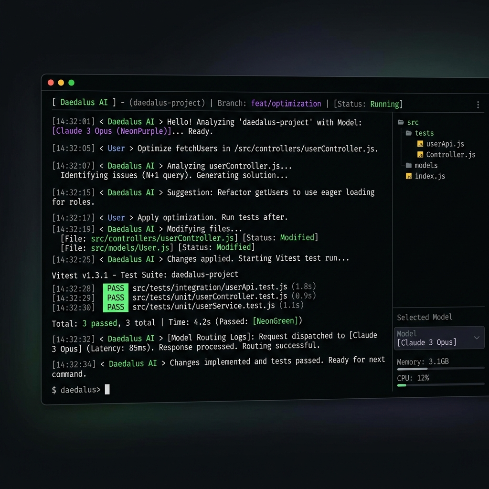

# Daedalus Docs

Welcome to the Daedalus documentation. Use the sidebar to browse guides, configuration reference, orchestration, MCP integration, and sandboxing.

  <video src="images/Daedalus__Local-First_AI.mp4" width="100%" controls></video>

Jump straight to:
- [Configuration Reference](configuration-reference.md)
- [Model Routing & Tuning](routing-and-tuning.md)
- [Orchestration](orchestration.md)
- [Autonomous Finn Loop](finn-loop.md)
- [MCP Integration](mcp.md)
- [Sandboxing](sandboxing.md)
- [Example Run: Social Media Manager](social-media-manager-sprint.md)

---

## Interactive CLI

Daedalus provides a premium terminal-based user interface for orchestrating agents and model routing:

---

## Features

  

    

      <svg width="32" height="32" viewBox="0 0 32 32" fill="none" xmlns="http://www.w3.org/2000/svg">
        <circle cx="16" cy="8" r="3" stroke="#00d4aa" stroke-width="2"/>
        <circle cx="8" cy="24" r="3" stroke="#00d4aa" stroke-width="2"/>
        <circle cx="24" cy="24" r="3" stroke="#00d4aa" stroke-width="2"/>
        <path d="M16 11L8 21M16 11L24 21M8 21H24" stroke="#00d4aa" stroke-width="2"/>
      </svg>
    

    <h3>Multi-Agent</h3>
    
Orchestrate specialized agents that collaborate on complex tasks

  

  

    

      <svg width="32" height="32" viewBox="0 0 32 32" fill="none" xmlns="http://www.w3.org/2000/svg">
        <rect x="6" y="10" width="12" height="12" rx="2" stroke="#7c3aed" stroke-width="2"/>
        <path d="M18 16H26M22 12V20" stroke="#7c3aed" stroke-width="2" stroke-linecap="round"/>
      </svg>
    

    <h3>MCP Native</h3>
    
Browse, install, and manage MCP servers from the official registry

  

  

    

      <svg width="32" height="32" viewBox="0 0 32 32" fill="none" xmlns="http://www.w3.org/2000/svg">
        <rect x="4" y="6" width="24" height="18" rx="2" stroke="#00d4aa" stroke-width="2"/>
        <path d="M4 10H28" stroke="#00d4aa" stroke-width="2"/>
        <circle cx="8" cy="8" r="1" fill="#00d4aa"/>
        <circle cx="12" cy="8" r="1" fill="#00d4aa"/>
        <path d="M10 18L12 20L18 14" stroke="#00d4aa" stroke-width="2" stroke-linecap="round" stroke-linejoin="round"/>
      </svg>
    

    <h3>Local First</h3>
    
Runs entirely on your machine with any LLM backend you choose

  

  

    

      <svg width="32" height="32" viewBox="0 0 32 32" fill="none" xmlns="http://www.w3.org/2000/svg">
        <path d="M18 4L8 18H18L14 28L24 14H14L18 4Z" fill="#00d4aa"/>
      </svg>
    

    <h3>Fast & Lean</h3>
    
Instant startup, context-aware pruning, and compact terminal UI

  

---

## System Architecture

At its core, Daedalus coordinates specialized subagents through an embedded model router to solve coding tasks locally or via cloud models:

