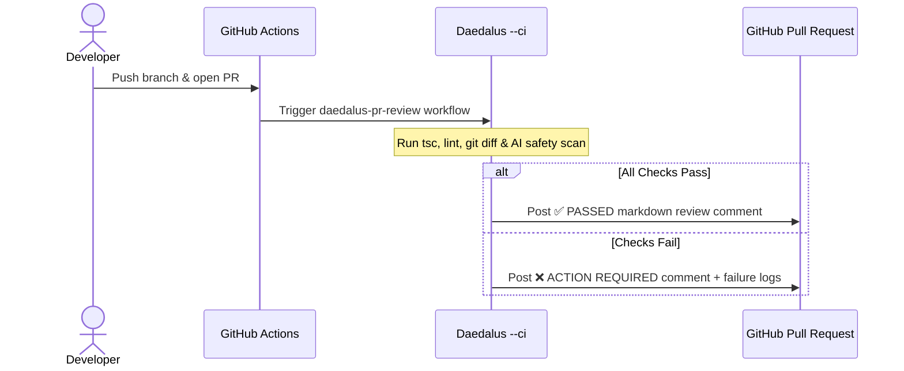

# Autonomous CI/CD PR Reviewer & Fix Bot (`daedalus --ci`)

Daedalus includes a **Headless CI/CD Mode** that automates code reviews and bug fixes for Pull Requests. You can simulate PR reviews locally before opening a pull request, or run Daedalus automatically in GitHub Actions to comment on code reviews and repair broken builds.

---

## Architecture Overview



---

## 1. Local PR Simulation (`/ci` & `/ci fix`)

Before opening or pushing a Pull Request, you can run a full CI/CD audit locally inside any Daedalus session:

### Simulate PR Review (`/ci`)
```text
daedalus
> /ci
```
Daedalus runs type-checking (`npx tsc --noEmit`), linter verification (`npm run lint`), and inspects modified files to generate a full Markdown report preview.

### Auto-Fix Lint & Format Errors (`/ci fix`)
```text
daedalus
> /ci fix
```
Daedalus automatically applies formatting and linter fixes (`eslint --fix`) to resolve failing checks before you commit your code.

---

## 2. Headless CLI Syntax (`daedalus --ci`)

For automated shell scripts and CI pipelines, Daedalus supports non-interactive CLI flags:

```bash
# Run headless PR review audit and exit with status 0 (pass) or 1 (fail)
npx daedalus-cli --ci review

# Run headless auto-fix mode
npx daedalus-cli --ci fix
```

---

## 3. Setting Up Automated GitHub Action PR Reviews (2 Minutes)

To automatically post AI PR review comments on every incoming pull request in your GitHub repository:

### Step 1: Copy the Workflow File
Save the following file in your repository at `.github/workflows/daedalus-pr-review.yml`:

```yaml
name: Daedalus PR Review

on:
  pull_request:
    types: [opened, synchronize, reopened]

jobs:
  daedalus-review:
    name: Daedalus Automated Code Review
    runs-on: ubuntu-latest
    permissions:
      contents: read
      pull-requests: write

    steps:
      - name: Checkout code
        uses: actions/checkout@v4
        with:
          fetch-depth: 0

      - name: Setup Node.js
        uses: actions/setup-node@v4
        with:
          node-version: '20'
          cache: 'npm'

      - name: Install dependencies
        run: npm ci

      - name: Run Daedalus Headless PR Review
        id: daedalus
        run: |
          npx daedalus-cli --ci review > pr_review_report.md || true
          cat pr_review_report.md

      - name: Post PR Review Comment
        uses: actions/github-script@v7
        with:
          script: |
            const fs = require('fs');
            const report = fs.readFileSync('pr_review_report.md', 'utf8');
            
            github.rest.issues.createComment({
              issue_number: context.issue.number,
              owner: context.repo.owner,
              repo: context.repo.repo,
              body: report
            });
```

### Step 2 (Optional): Add API Key for Cloud LLM Analysis
If you want Daedalus to analyze PR diffs with cloud models in GitHub Actions:
1. Go to your GitHub repository.
2. Navigate to **Settings > Secrets and variables > Actions**.
3. Add `OPENAI_API_KEY` (or your preferred provider key) under **Repository secrets**.

That's it! Daedalus will now automatically review every Pull Request opened on your repository! 🎉
