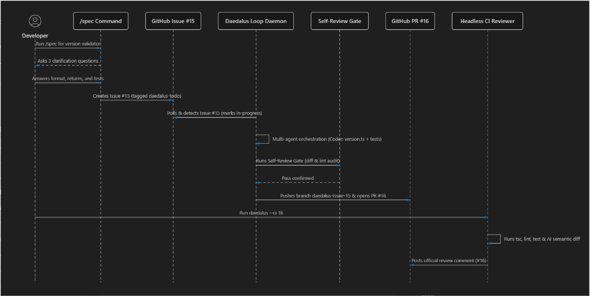
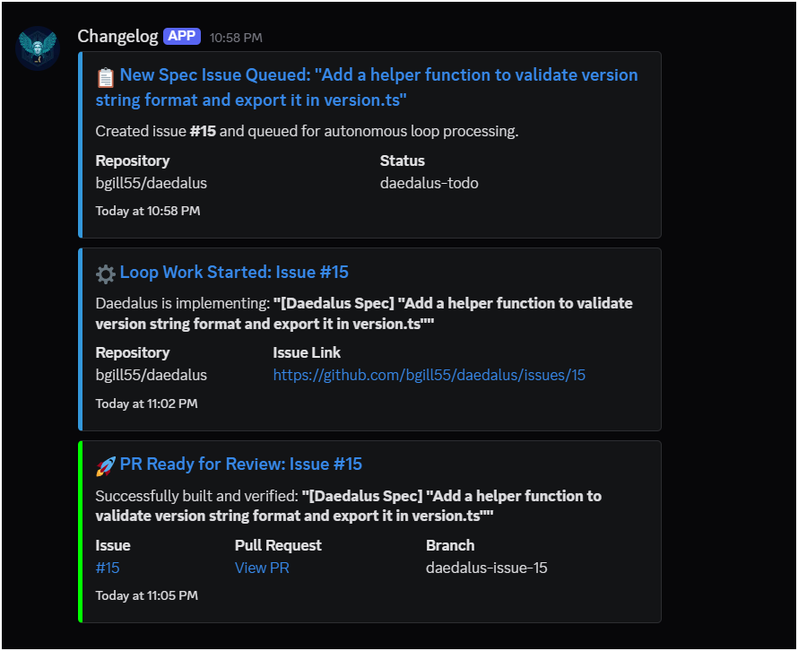

# Autonomous Coding Lifecycle: Finn Loop & Headless CI Review Case Study

This case study documents an authentic, end-to-end execution of the **Daedalus Autonomous Finn Loop** (`daedalus --loop`) and **Headless CI Reviewer** (`daedalus --ci`), building and reviewing a real feature from interactive specification to GitHub Pull Request.

---

## 🗺️ Architectural Workflow



---

## 📍 Stage 1: Interactive Requirement Specification (`/spec`)

* **Session ID:** `session-1785387334336-a7b718`
* **Target:** GitHub Issue [#15](https://github.com/bgill55/daedalus/issues/15)

### Command Execution
```bash
/spec "Add a helper function to validate version string format and export it in version.ts"
```

### Interactive Clarification Dialogue
```text
--- Clarification Questions ---
1. What exact version pattern should be accepted?
   └─ Answer: Standard SemVer MAJOR.MINOR.PATCH (e.g. 1.93.0) with optional pre-release tag.

2. Should the validator throw, return a boolean, or return an error object?
   └─ Answer: Return a boolean (true if valid, false if invalid).

3. Where will version.ts be imported and do you need accompanying tests?
   └─ Answer: Export isValidSemver(v: string): boolean from src/version.ts and include co-located unit test src/version.test.ts.
```

### Resulting Issue
The CLI automatically compiled the specification and created **GitHub Issue #15**: `[Daedalus Spec] "Add a helper function to validate version string format and export it in version.ts"` with the label `daedalus-todo`.

---

## ⚙️ Stage 2: Autonomous Daemon Execution (`daedalus --loop`)

The background loop daemon monitored the repository, picked up Issue #15, and executed the multi-agent task workflow.

### 🔔 Live Discord Webhook Notifications
As the loop progressed, Daedalus dispatched rich color-coded status embeds to the Discord team channel for spec queuing, work start, and PR readiness:



### Terminal Execution Trace
```text
======================================
   DAEDALUS FINN LOOP DAEMON ACTIVE
======================================

Monitoring repository: bgill55/daedalus
Looking for issues with label 'daedalus-todo'...
Discord notification channel active.

[11:02:51 PM] Checking for open tickets...

🚀 Found issue: #15 - "[Daedalus Spec] "Add a helper function to validate version string format and export it in version.ts""
✔ Sent Discord notification embed.
Starting orchestration for Issue #15...

--- Orchestration Task List ---
  [▶] Task 1: [coder] create src/version.ts with the isValidSemver function...
  [▶] Task 2: [coder] create src/version.test.ts with a Vitest test suite...
--------------------------------

[SPAWN] Delegating to coder: create src/version.ts...
[SPAWN] Delegating to coder: create src/version.test.ts...

[VERIFY] Running verification command: "npx tsc --noEmit"...
[VERIFY] Verification passed.
[VERIFY] Running linter command: "npm run lint"...
[VERIFY] Linter passed.

[REVIEWER] Found issues — triggering repair pass...
[REPAIR] Repair pass complete.

  ── Self-Review Gate ──────────────────────────────────────────
  Working tree clean — skipping diff inspection.
  ──────────────────────────────────────────────────────────────

✔ Self-review gate passed. Pushing changes...
Switched to a new branch 'daedalus-issue-15'
To https://github.com/bgill55/daedalus.git
 * [new branch]      daedalus-issue-15 -> daedalus-issue-15

Opening Pull Request...
✔ PR opened: https://github.com/bgill55/daedalus/pull/16
✔ Sent Discord notification embed.
Switched to branch 'main'
```

---

## 🤖 Stage 3: Headless CI/CD Reviewer (`daedalus --ci 16`)

Once PR #16 was opened, the headless CI reviewer was invoked to perform automated static checks and AI semantic diff inspection.

* **Pull Request:** [GitHub PR #16](https://github.com/bgill55/daedalus/pull/16)
* **Live GitHub Review Comment:** [PR #16 Issue Comment](https://github.com/bgill55/daedalus/pull/16#issuecomment-5126853096)

### Terminal Execution Trace
```text
PS D:\Daedalus> npx tsx src/index.ts --ci 16

   DAEDALUS   v1.93.0 · bgill55_dev

## 🤖 Daedalus Automated PR Review

**Overall Status**: ✅ PASSED

### 🔍 Verification Checks
- **Type Check (`npx tsc`)**: ✅ Passed
- **Linter (`npm run lint`)**: ✅ Passed
- **Test Suite (`npm test`)**: ✅ Passed

### 🧠 Daedalus Semantic Analysis
✅ No semantic issues found.

---
*Automated review generated by [Daedalus CLI](https://github.com/bgill55/daedalus)*

✔ Posted CI review comment to PR #16
```

---

## 📦 Verified Deliverables

1. **`src/version.ts`**: Clean export of `isValidSemver(v: string): boolean` with full JSDoc comments.
2. **`src/version.test.ts`**: Comprehensive Vitest test suite covering valid SemVer strings (`1.93.0`, `0.0.0`, `1.93.0-canary`, `2.0.1-beta.2`) and invalid strings (`''`, `1.2`, invalid metadata).
3. **100% Automated Workflow**: Zero manual code edits required—from `/spec` prompt to merge-ready PR comment!
