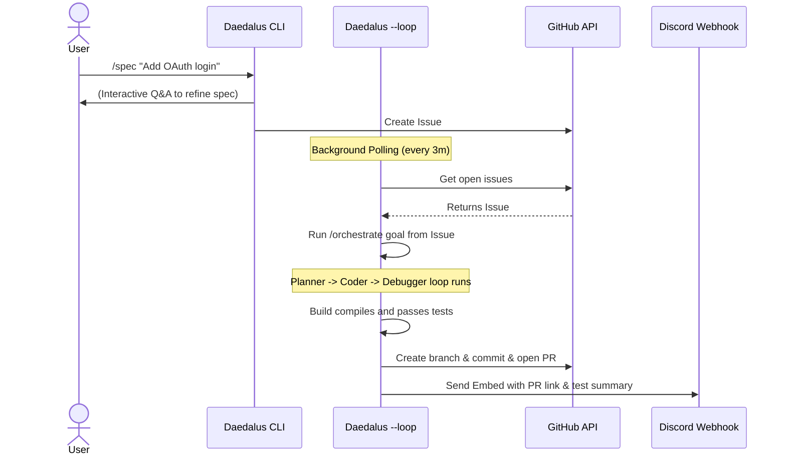

# Autonomous Finn Loop

Daedalus supports the **Finn Loop** autonomous coding lifecycle. This feature lets you queue feature requirements through an interactive specification command, run an autonomous background daemon to build and verify those requirements, and receive PR notifications with test summaries directly in your team's Discord channel.

---

## Architecture Diagram



---

## 1. Specification Gathering (`/spec`)

Instead of writing specifications by hand, you can use the `/spec` command inside any active Daedalus CLI/TUI session:

```text
daedalus
> /spec "Add user profile avatar upload"
```

1.  **Requirement Clarification:** The agent (using the `planner` model tier) prompts you with 2-3 targeted questions to clarify design choices, file targets, and constraints.
2.  **Drafting the Spec:** The model combines your answers and original idea to draft a detailed Markdown specification.
3.  **GitHub Issue Creation:** The agent automatically calls the GitHub API to create an issue on your repository containing the spec, tagged with the `daedalus-todo` label.

---

## 2. Autonomous Loop Daemon (`daedalus --loop`)

Run the daemon in your terminal or as a background service:

```bash
daedalus --loop
```

Every **3 minutes**, the daemon polls GitHub for open issues containing the `daedalus-todo` label. When it finds one:

1.  **Claims the Ticket:** It moves the label on the issue to `daedalus-in-progress` to prevent duplicate runs.
2.  **Autonomous Orchestration:** It fires the multi-agent `Orchestrator` to implement the specification, running local builds/linters/tests at every step.
3.  **Automatic Workspace Rollback:** If the build fails and the agent exhausts its repair attempts, changes are reverted using Git, and the issue is moved to `daedalus-todo` + `daedalus-failed`.
4.  **Pull Request Submission:** If verification passes, the daemon commits the changes, checks out a new branch, pushes to remote GitHub origin, opens a Pull Request, and labels the issue as `daedalus-done`.

---

## 3. Discord Reviews

If configured, the daemon posts a rich color-coded status embed directly to your Discord channel via Discord webhook. It includes:
*   Link to the GitHub Pull Request.
*   Link to the original issue.
*   The checkout branch name.
*   Status summary of the verification build.

---

## Setup & Configuration

To enable the Finn Loop, configure the following environment variables in your terminal profile or environment manager:

```bash
# GitHub Access Token (requires repo write permissions)
export GITHUB_TOKEN="ghp_yourpersonalaccesstoken..."

# Optional Discord Webhook URL for progress/PR notifications
export DISCORD_WEBHOOK_URL="https://discord.com/api/webhooks/..."
```
