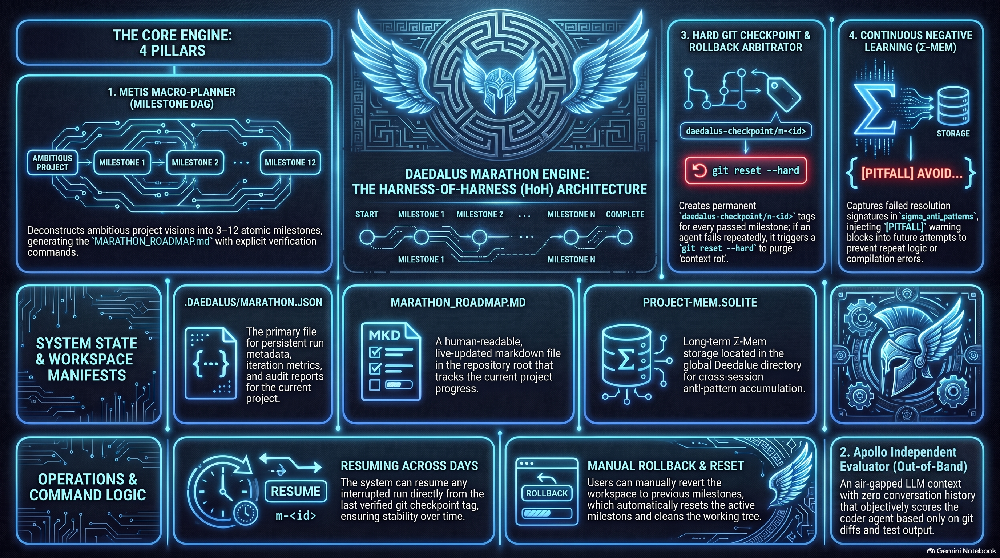

# Daedalus Marathon Engine: Harness-of-Harness (HoH) Architecture

<p align="center">
  
</p>

The **Daedalus Marathon Engine** (`/marathon`) is a meta-orchestration framework designed for **multi-day autonomous software development**.

While standard coding assistants and sprint tools excel at 15-to-30-minute tasks, long-horizon software development across dozens of iterations typically suffers from **context rot**, **the regression trap** (endless repair cycles), and **biased self-testing**.

The Marathon Engine sits above the individual agent roles, organizing work into an ordered milestone DAG, executing air-gapped evaluations, establishing hard git checkpoints, and accumulating cross-session negative learning via $\Sigma$-Mem.

---

## The 4 Architectural Pillars

```
┌─────────────────────────────────────────────────────────────────────────────┐
│                      DAEDALUS MARATHON META-HARNESS                         │
│  - Roadmap DAG & State Machine (.daedalus/marathon.json + SQLite)           │
│  - Checkpoint & Rollback Arbitrator (Git Tags: daedalus-checkpoint/m-*)      │
│  - Σ-Mem Anti-Pattern & Capability Ledger                                    │
└──────────────────────────────────────┬──────────────────────────────────────┘
                                       │
            ┌──────────────────────────┴──────────────────────────┐
            ▼                                                     ▼
┌──────────────────────────────────────┐  ┌───────────────────────────────────┐
│        WORKER SPRINT HARNESS         │  │   AIR-GAPPED EVALUATION HARNESS   │
│  - Metis (Milestone Decomposition)   │  │  - Apollo (Isolated Context)      │
│  - Hephaestus (Coder / Builder)      │  │  - Independent Test & Lint Probes │
│  - Asclepius (Targeted Healer)       │  │  - Acceptance Criteria Scoring    │
│  - Σ-Mem Pitfall Injection           │  │  - Regression & Debt Detection    │
└──────────────────────────────────────┘  └───────────────────────────────────┘
```

### 1. Metis Macro-Planner (Milestone DAG Decomposition)
- Deconstructs an ambitious project vision into 3 to 12 atomic, verifiable milestones.
- Generates and maintains `MARATHON_ROADMAP.md` in the repository root.
- Each milestone declares explicit target files, behavioral acceptance criteria, and verification commands.

### 2. Air-Gapped Independent Evaluator (Apollo Out-of-Band)
- The evaluator runs in an **isolated LLM context** with zero conversation history from the coder agent.
- Receives only the milestone criteria, the git diff (`git diff <checkpoint>..HEAD`), and real test execution output.
- Checks for tautological/mocked tests, criteria fulfillment, and regressions, returning an objective score (0–100) and verdict.

### 3. Hard Git Checkpoint & Rollback Arbitrator
- Every passed milestone creates a permanent git tag: `daedalus-checkpoint/m-<id>`.
- If an iteration fails repeatedly or enters an unproductive repair loop, the Arbitrator executes a hard rollback:
  `git reset --hard daedalus-checkpoint/m-(N-1)`
- Untracked artifacts are purged (`git clean -fd`), resetting the workspace to a known clean state and eliminating context rot.

### 4. Continuous Negative Learning with $\Sigma$-Mem
- When a milestone attempt fails or regresses, the error signature and attempted resolution are recorded into `sigma_anti_patterns`.
- Subsequent attempts receive `[PITFALL]` warning blocks in their context, preventing the agent from repeating the same compilation or logic mistakes.

---

## Commands & Usage

### Start a New Marathon
```bash
/marathon "Build a real-time multiplayer Kanban board with SQLite persistence and websockets"
```
Metis analyzes the workspace, creates `MARATHON_ROADMAP.md`, provisions the `marathon/<slug>` branch, and begins Milestone 1.

### View Live Status & Roadmap
```bash
/marathon status
```
Renders the visual ASCII progress roadmap, active milestone, criteria checklist, and Apollo audit scores.

### Resume Across Days or Sessions
```bash
/marathon resume
```
Resumes an interrupted or paused run directly from the last verified checkpoint tag.

### Manual Rollback
```bash
/marathon rollback
```
Reverts the working tree to the previous verified milestone tag and resets the active milestone.

### Abort Run
```bash
/marathon abort
```
Marks the active marathon run as aborted.

---

## State & File Manifests

- `.daedalus/marathon.json`: Persistent run metadata, milestone states, audit reports, and iteration metrics.
- `MARATHON_ROADMAP.md`: Human-readable, live-updated markdown roadmap in the repository root.
- `~/.daedalus/sessions/<project-hash>/project-mem.sqlite`: Long-term $\Sigma$-Mem anti-pattern storage.