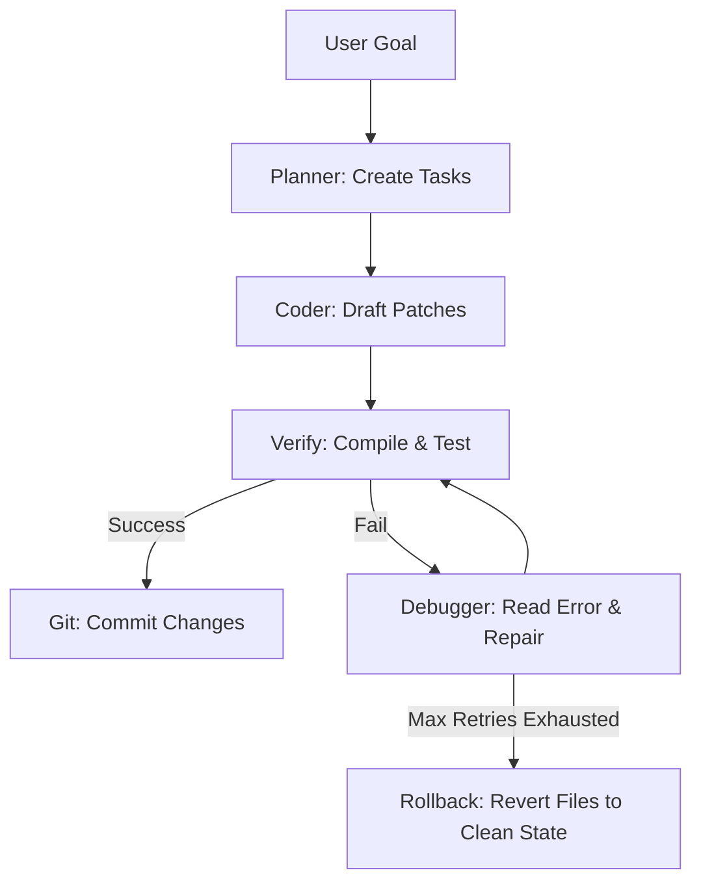

# Daedalus: Local-First AI Coding CLI & Agent Orchestrator

Daedalus (published on npm as `daedalus-cli`) is a local-first AI coding companion and multi-agent developer workbench. It runs locally on your machine, leveraging local or cloud-based Large Language Models (LLMs) to plan, execute, debug, and verify software engineering tasks while keeping your code and intellectual property completely private.

<p align="center">
  
</p>

---

## Core Philosophy & Design

* **Local-First & Private**: Integrates with local LLM providers (LM Studio, Ollama, llama.cpp, vLLM) so that your source code does not leave your local network. It can also route to cloud providers (OpenAI, Anthropic, Gemini, Groq) if configured.
* **Multi-Agent Orchestration**: Instead of a single LLM trying to solve complex tasks in one go, Daedalus delegates work to specialized autonomous sub-agents collaborating under a planner.
* **Loop Engineering & Verifiability**: Unlike models that edit code and hope it works, Daedalus runs stack-aware verification checks (compiling, linting, unit testing) after every edit and automatically repairs syntax errors or rolls back files on failure.
* **Premium UX**: Runs as a simple terminal command line or a rich terminal user interface (TUI) featuring real-time CPU/RAM gauges and dynamic file-tree context selectors.

---

## 1. System Architecture & Agent Roles

Daedalus coordinates five specialized sub-agents to divide and conquer coding goals:

* **Planner**: Explores requirements, creates step-by-step task lists, and determines acceptance criteria for verification.
* **Coder**: Writes new files, makes surgical edits using a patch tool, and executes shell scripts.
* **Researcher**: Explores the local workspace, reads documentation, and searches the web.
* **Debugger**: Runs test suites, analyzes error logs, and corrects syntax/logic failures.
* **Reviewer**: Reviews pull requests, runs security checks, and validates styles/formatting.

### Loop Engineering Lifecycle



---

## 2. Key Features

### 1. Embedded Model Router, Tier Selection & Multi-Model Fallback Chain
Daedalus features an embedded model router that handles failover, round-robin, priority, or fastest-response load balancing across local and remote LLMs.
* **Model Tiers**: Configurations divide models into tiers (`intelligence`, `standard`, `fast`). High-effort tasks (planning, code reviews) route to intelligence models (e.g., GPT-4o, Claude 3.5 Sonnet), while simple edits route to standard/fast local models.
* **Multi-Model Fallback Chain**: If a provider returns a rate-limit (429), timeout, or 5xx server error, the router automatically fails over to the next candidate model in the chain without interrupting active user sessions or agent execution loops.

### 2. Auto-Discovery Tech Stack Scanner
On startup, Daedalus scans your project files (such as `package.json`, `tsconfig.json`, `Cargo.toml`, `go.mod`, `requirements.txt`) to determine the exact frameworks, scripts, and compilers. This prevents the LLM from hallucinating wrong syntax, libraries, or build flags.

### 3. Cursor & Claude Code Rules Compatibility
Daedalus automatically detects and inherits instructions from `CLAUDE.md`, `.cursorrules`, `.daedalusrules`, and `DAEDALUS.md` files located in your project's root. This lets you import existing senior-developer guidelines directly into your local Daedalus turns without any manual conversion.

### 4. Background Live File-Watcher (`/watch`)
Runs a background file watcher using SQLite FTS5. As you edit and save files in your editor, Daedalus updates codebase symbol definitions and call-graph references in real-time without requiring manual re-indexing.

### 5. Git-Aware Smart Testing (`/test -g`)
Inspects `git status` to identify modified source files, maps them to their corresponding `*.test.ts` unit test suites, and runs only affected test files—reducing test feedback loops from seconds to less than 200ms.

### 6. MCP Marketplace & Explorer (`/mcp explore`)
Full native Model Context Protocol (MCP) server support over `stdio` and `http` (SSE). Includes an interactive marketplace (`/mcp explore`) to search and install community MCP servers (GitHub, SQLite, Postgres, Puppeteer, Memory, Google Drive) with one-click setup.

### 7. Persistent Memory & User Profiles
* **Project Memory**: Auto-detects and persists project facts and custom coding conventions across sessions.
* **User Profile**: Customizes agent tone, experience level, preferred terminal shell, and coding style.

### 8. Autonomous Finn Loop
Exposes a fully autonomous developer workflow (Spec → Build → Review → PR → Discord Notify):
* `/spec` command: Interactively gathers requirements, generates a markdown spec, and opens a GitHub Issue labeled `daedalus-todo`.
* `daedalus --loop` daemon: Polls GitHub for open issues, runs autonomous orchestration to solve them, executes verifications, commits changes, opens a Pull Request, and alerts team channels via Discord Webhooks.

---

## 3. Real-World Benchmarks & Practical Case Studies

### Case Study A: Autonomous Feature Engineering (`/health` Command)
* **Objective**: Implement a new `/health` command in Daedalus CLI to display model router provider latency, health status, and API key statuses.
* **Workflow**: Generated spec via `/spec`, created GitHub Issue #6, spawned coder agent to build `src/commands/health.ts`, verified with `npx tsc --noEmit` and Vitest unit tests, opened PR #7, ran automated code review with reviewer rules, and merged clean code.

### Case Study B: Social Media Manager Automation
* **Objective**: Build a full-stack social media scheduling dashboard and AI content generator.
* **Workflow**: Daedalus scanned project stack, orchestrated sub-agents to generate React/Vite UI components, configured SQLite storage, added unit test coverage, verified builds, and deployed with zero manual syntax errors.

### Case Study C: Multi-Model Failover Under Rate Limits
* **Scenario**: Primary local model endpoint hits a 429 rate limit mid-orchestration turn.
* **Behavior**: Model router marked endpoint unhealthy, seamlessly failed over to secondary model in priority chain, completed tool calls, and returned complete response with zero session failure.

---

## 4. CLI Commands Reference

| Command | Category | Description |
|---|---|---|
| `/orchestrate <goal>` | Multi-Agent | Launch multi-agent planning and execution loop |
| `/spawn [--bg] <role> <task>` | Multi-Agent | Delegate a background task to a sub-agent |
| `/task <id>` | Multi-Agent | Manage or inspect background tasks |
| `/tasks` | Multi-Agent | List active background tasks |
| `/ensemble <goal>` | Multi-Agent | Run multi-model ensemble drafting pipeline |
| `/spec <idea>` | Workflow | Interactively flesh out a feature spec and open GitHub Issue |
| `/watch [start\|stop\|status]` | Codebase | Background file watcher for automatic symbol re-indexing |
| `/index` | Codebase | Manually index codebase symbols into SQLite FTS5 |
| `/find <query>` | Codebase | Search indexed symbols in project |
| `/refs <symbol>` | Codebase | Find symbol caller references |
| `/def <symbol>` | Codebase | Jump to symbol definition |
| `/test [n] [-g]` | Dev Tools | Run test loop and repair failures (`-g` for git-aware smart testing) |
| `/commit [msg]` | Dev Tools | Stage and commit git changes |
| `/branch [name]` | Dev Tools | Git branch operations |
| `/pr [base]` | Dev Tools | Generate PR description compared to base branch |
| `/mcp <explore\|search\|install>` | MCP | Manage MCP servers (explore marketplace, search, install) |
| `/image <prompt>` | Image Gen | Generate UI assets using Stable Diffusion WebUI or Pollinations AI |
| `/undo` | Safety | Revert the last applied file patch |
| `/add <file>` | Context | Add file to active prompt context |
| `/remove <file>` | Context | Remove file from active prompt context |
| `/context` | Context | Show active file context |
| `/paste` | Context | Paste clipboard text or image into prompt |
| `/health` | Diagnostics | Display router provider latency, health status, and API key statuses |
| `/config` | Config | View or modify global configuration settings |
| `/project` | Config | View or set project-level config settings (`.daedalusrc`) |
| `/memory` | Memory | View stored project facts and conventions |
| `/fact <text>` | Memory | Add a fact to project memory |
| `/convention <text>` | Memory | Add a coding convention to project memory |
| `/session [name]` | Session | Manage, save, restore, or export chat sessions |

---

## 5. Configuration Reference (`~/.daedalus/config.json`)

The global configuration governs model priority chains, UI preferences, and safety guidelines:

```json
{
  "version": 1,
  "router": {
    "strategy": "priority",
    "chain": [
      {
        "name": "local-llm",
        "endpoint": "http://localhost:1234/v1",
        "model": "auto",
        "priority": 1,
        "enabled": true,
        "supportsTools": true,
        "tier": "intelligence"
      },
      {
        "name": "ollama-fallback",
        "endpoint": "http://localhost:11434/v1",
        "model": "qwen2.5-coder",
        "priority": 2,
        "enabled": true,
        "supportsTools": true,
        "tier": "standard"
      }
    ]
  },
  "agents": {
    "default": "coder",
    "autoOrchestrate": true
  },
  "ui": {
    "streaming": true,
    "showTokens": true,
    "theme": "dark",
    "tui": false,
    "collapseCommentary": true
  },
  "safety": {
    "protectGit": true,
    "autoApprove": false
  }
}
```

### Key Environment Variables
* `GITHUB_TOKEN` / `GH_TOKEN`: GitHub authentication token for PR creation and issue tracking.
* `DISCORD_WEBHOOK_URL`: Webhook URL for Discord status alerts and release announcements.
* `DAEDALUS_AUTO_APPROVE`: When set to `true`, enables non-interactive auto-approval for terminal commands.
