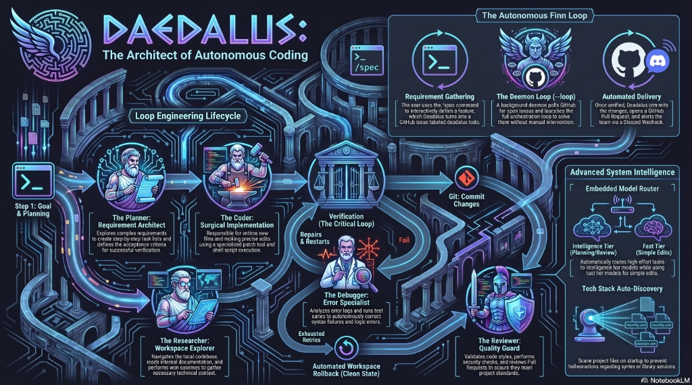
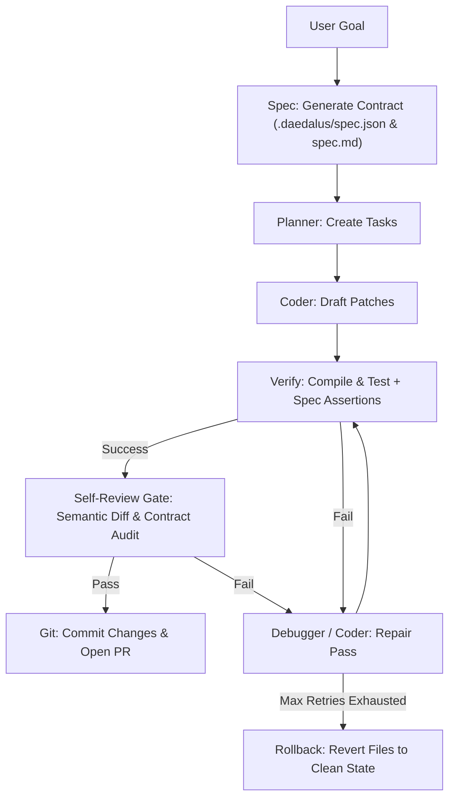

# Daedalus: Local-First AI Coding CLI & Agent Orchestrator

Daedalus (published on npm as `daedalus-cli`) is a local-first AI coding companion and multi-agent developer workbench. It runs locally on your machine, leveraging local or cloud-based Large Language Models (LLMs) to plan, execute, debug, and verify software engineering tasks while keeping your code and intellectual property completely private.

<p align="center">
  
</p>

> **🎨 Explore the Visual Knowledge Hub on Discord:**
> Browse all NotebookLM infographics, architectural diagrams, audio summaries, and video demonstrations directly in our **[Discord Knowledge Channel](https://discord.com/channels/1530095347651575939/1532496845035802795)**!

---

## Core Philosophy & Design

* **Local-First & Private**: Integrates with local LLM providers (LM Studio, Ollama, llama.cpp, vLLM, FreeLLMAPI) so that your source code does not leave your local network. It can also route to cloud providers (OpenAI, Anthropic, Gemini, Groq) if configured.
* **Multi-Agent Orchestration**: Instead of a single LLM trying to solve complex tasks in one go, Daedalus delegates work to specialized autonomous sub-agents collaborating under a planner.
* **Loop Engineering & Verifiability**: Unlike models that edit code and hope it works, Daedalus runs stack-aware verification checks (compiling, linting, unit testing) after every edit and automatically repairs syntax errors or rolls back files on failure.
* **Self-Review Gate & Qodo-Level Audits**: Includes a pre-commit AI semantic diff gate that inspects code for logic errors, JSDoc contract mismatches, and `AGENTS.md` comment rule violations before committing.
* **Premium UX**: Runs as a simple terminal command line or a rich terminal user interface (TUI) featuring real-time CPU/RAM gauges and dynamic file-tree context selectors.

---

## 1. System Architecture & Agent Roles

Daedalus coordinates six specialized sub-agents to divide and conquer coding goals:

* **Spec**: Generates formal SpecFirst interface contracts (`.daedalus/spec.json` & `spec.md`), TypeScript schemas, and test assertions before coding.
* **Planner**: Explores requirements, creates step-by-step task lists, and determines acceptance criteria for verification.
* **Coder**: Writes new files, makes surgical edits using a patch tool, and executes shell scripts.
* **Researcher**: Explores the local workspace, reads documentation, and searches the web.
* **Debugger**: Runs test suites, analyzes error logs, and corrects syntax/logic failures.
* **Reviewer**: Reviews pull requests, runs security checks, verifies JSDoc contract alignment, and validates styles/formatting.

### Loop Engineering Lifecycle



---

## 2. Key Features

### 1. Embedded Model Router, Tier Selection & Multi-Model Fallback Chain
Daedalus features an embedded model router that handles failover, round-robin, priority, or fastest-response load balancing across local and remote LLMs.
* **Model Tiers**: Configurations divide models into tiers (`intelligence`, `standard`, `fast`). High-effort tasks (planning, code reviews) route to intelligence models (e.g., GPT-4o, Claude 3.5 Sonnet, FreeLLMAPI), while simple edits route to standard/fast local models.
* **Multi-Model Fallback Chain**: If a provider returns a rate-limit (429), timeout, or 5xx server error, the router automatically fails over to the next candidate model in the chain without interrupting active user sessions or agent execution loops.

### 2. Autonomous Finn Loop (`daedalus --loop`)
* Interactive requirements specification via `/spec`.
* Automated polling of GitHub Issues with `daedalus-todo` labels.
* End-to-end multi-agent orchestration, automated testing, and pre-commit review gates.
* Automatic branch creation (`daedalus-issue-X`) and GitHub Pull Request creation.

### 3. Headless CI/CD PR Reviewer (`daedalus --ci`)
* Runs headless in GitHub Actions or locally (`daedalus --ci <pr-number>`).
* Executes static type-checking (`npx tsc`), linting (`npm run lint`), and unit test suites (`npm test`).
* Performs AI semantic diff analysis to catch logic bugs and JSDoc contract violations.
* Posts structured markdown review reports directly to GitHub PR comments.

### 4. Discord Bot & Webhook Integrations
* Built-in Discord Bot engine (`npm run bot`) featuring live version and release notes self-awareness.
* Rich color-coded Discord webhook embeds for spec queuing, loop work starts, self-review alerts, and PR readiness.

### 5. AST-Aware Codebase Indexing (FTS5 SQLite) & Call Graph Engine
* Indexes TypeScript/JavaScript, Python, Go, Rust, Java, C/C++, C#, PHP, Ruby, and Elixir into a local SQLite FTS5 database (`.daedalus/index.db`).
* Supports exact symbol search (`/find`), definition lookups (`/def`), reference tracing (`/refs`), AST-aware call graph building (`/callgraph`), and blast-radius impact analysis (`/impact`).

### 6. Built-in Tool Matrix (16 Tools + MCP Transport)
* Includes built-in tools for file reading, writing, patching, terminal execution, web searching, screenshot previewing, image generation, and indexing.
* Full Model Context Protocol (MCP) transport support over stdio and HTTP/SSE.

### 7. Execution Sandboxing (Docker & WSL)
* Supports executing shell commands inside Docker containers or Windows Subsystem for Linux (WSL) environments.

### 8. Custom Command Shortcuts (`/shortcut` / `/sc`)
* Create and manage custom slash-command aliases stored in `~/.daedalus/shortcuts.json`.

### 9. Badge Generator (`/badge`)
* Generate automatic and custom Shields.io badges for project READMEs.

### 10. Autonomous Bug Hunting (`/hunt` / `/bug`)
* Autonomously reproduces, isolates root causes, fixes, and verifies bug reports.

### 11. Interactive Terminal User Interface (TUI) Dashboard (`/tui`)
* Displays active agent status, model router latency, token usage gauges, and file-tree context selectors.

### 12. Smart Git-Aware Testing Loop (`/test -g`)
* Analyzes modified git files to run only relevant unit test suites for faster turn feedback.

### 13. Persistent Project Memory & Fact Extraction
* SQLite-backed session persistence (`~/.daedalus/session.db`) automatically extracts project facts and conventions across chat sessions.

### 14. Chat-History Branching System ("What-if" Sessions)
* Non-linear session branching (`/session branch`, `/session checkout`, `/session merge`) for exploring alternative implementation paths.

### 15. SpecFirst Architecture & Contract Verification Engine (`/spec`)
* Enforces formal specification gathering, type contracts, and automated assertion verification before code is written or committed.
* Generates `.daedalus/spec.json` and `.daedalus/spec.md` with explicit TypeScript interfaces, function signatures, and test cases.
* Injects spec contracts into sub-agent contexts (`coder`, `planner`, `reviewer`) to ensure 100% cross-file type alignment.
* Runs `verifySpecAssertions()` during build verification to validate file existence, export signatures, and contract snippets.

---

## 3. Real-World Benchmarks & Practical Case Studies

### Test Suite Growth
Daedalus maintains a test suite of **480+ tests across 60 files** (Vitest), covering the model router, session branching, tool execution, config validation, codebase indexing, MCP transport, CLI commands, git-based merge systems, and system diagnostics.

### Case Study A: Autonomous Finn Loop & Headless CI Review Pipeline
This case study documents an authentic, end-to-end execution of the **Daedalus Autonomous Finn Loop** (`daedalus --loop`) and **Headless CI Reviewer** (`daedalus --ci`), building and reviewing a real feature from interactive specification to GitHub Pull Request.

#### Architectural Workflow


#### Stage 1: Interactive Requirement Specification (`/spec`)
* **Session ID:** `session-1785387334336-a7b718`
* **Target:** GitHub Issue [#15](https://github.com/bgill55/daedalus/issues/15)
* User issues `/spec "Add a helper function to validate version string format and export it in version.ts"`.
* System asks 3 interactive clarification questions (version pattern, return type, test requirements).
* Automatically generates **GitHub Issue #15** tagged with `daedalus-todo`.

#### Stage 2: Autonomous Daemon Execution (`daedalus --loop`)
* Daemon polls GitHub, detects Issue #15, and dispatches a **⚙️ Loop Work Started** Discord webhook embed.
* Multi-agent orchestrator delegates to Coder sub-agents to construct `src/version.ts` and `src/version.test.ts`.
* Verification engine runs `npx tsc --noEmit` and `npm run lint` (both pass!).
* **Magenta Self-Review Gate** executes AI semantic diff inspection, verifying code integrity.
* Automatically creates branch `daedalus-issue-15`, pushes to origin, and opens **GitHub PR #16**.
* Dispatches a **🚀 PR Ready** Discord embed with clickable links.

#### Stage 3: Headless CI/CD Reviewer (`daedalus --ci 16`)
* Developer invokes `npx tsx src/index.ts --ci 16`.
* Performs headless static verification (`npx tsc`, `npm run lint`, `npm test`) and AI semantic diff analysis.
* Posts official automated review comment directly to [GitHub PR #16 (Issue Comment #5126853096)](https://github.com/bgill55/daedalus/pull/16#issuecomment-5126853096).

#### Verified Deliverables
1. **`src/version.ts`**: Clean export of `isValidSemver(v: string): boolean` with JSDoc documentation.
2. **`src/version.test.ts`**: Comprehensive Vitest test suite covering valid SemVer strings (`1.93.0`, `0.0.0`, `1.93.0-canary`, `2.0.1-beta.2`) and invalid inputs.
3. **100% Automated Pipeline**: Zero manual code edits required—from `/spec` prompt to merge-ready PR comment!

---

## 4. CLI Commands Reference

| Command | Category | Description |
|---|---|---|
| `/autopilot <feature>` | Multi-Agent | Autonomous feature dev: branch, implement, verify, commit, and PR |
| `/orchestrate <goal>` | Multi-Agent | Launch multi-agent planning and execution loop |
| `/spawn [--bg] <role> <task>` | Multi-Agent | Delegate a background task to a sub-agent |
| `/task <id>` | Multi-Agent | Manage or inspect background tasks |
| `/tasks` | Multi-Agent | List active background tasks |
| `/ensemble <goal>` | Multi-Agent | Run multi-model ensemble drafting pipeline |
| `/spec <idea>` | Workflow | Interactively flesh out a feature spec and open GitHub Issue |
| `/debug <command>` | Workflow | Run a command and autonomously debug failures |
| `/undo [count\|list]` | Workflow | Revert the last N file patches or list recent patches |
| `/watch [start\|stop\|status]` | Codebase | Background file watcher for automatic symbol re-indexing |
| `/index` | Codebase | Manually index codebase symbols into SQLite FTS5 |
| `/find <query>` | Codebase | Search indexed symbols in project |
| `/refs <symbol>` | Codebase | Find symbol caller references |
| `/def <symbol>` | Codebase | Jump to symbol definition |
| `/callgraph <symbol> [depth]` | Codebase | Display bidirectional function call graph and blast radius |
| `/impact <symbol>` | Codebase | Analyze refactoring impact & blast radius for a symbol |
| `/test [n] [-g]` | Dev Tools | Run test loop and repair failures (`-g` for git-aware smart testing) |
| `/commit [msg]` | Dev Tools | Stage and commit git changes |
| `/branch [name]` | Dev Tools | Git branch operations |
| `/pr [base]` | Dev Tools | Generate PR description compared to base branch |
| `/ci [review\|fix]` | Dev Tools | Run headless CI/CD PR review or auto-fix simulation locally |
| `/shortcut` / `/sc` | Dev Tools | Manage custom slash-command aliases |
| `/badge` | Dev Tools | Generate automatic and custom Shields.io badges for READMEs |
| `/hunt` / `/bug` | Dev Tools | Autonomously hunt down and fix a bug |
| `/mcp <explore\|search\|install\|list>` | MCP | Manage MCP servers (explore marketplace, search, install) |
| `/image <prompt>` | Image Gen | Generate UI assets using Stable Diffusion WebUI or Pollinations AI |
| `/preview <filepath-or-url>` | Utilities | Screenshot a local HTML file or URL and save the image |
| `/stats` | Utilities | Display session analytics, token usage, index count, router status |
| `/history [n]` | Utilities | Show recent N turns with tool calls from the session log |
| `/lite` | Utilities | Show Daedalus Lite documentation |
| `/help [command]` | Utilities | Show available commands or detailed help for a specific command |
| `/exit` | Utilities | Save session and exit |
| `/onboard` | Setup | First-time setup: discover local models, configure, test |
| `/tui` | UI | Toggle the Terminal User Interface (TUI) dashboard |
| `/add <file>` | Context | Add file to active prompt context |
| `/remove <file>` | Context | Remove file from active prompt context |
| `/context` | Context | Show active file context |
| `/paste` | Context | Paste clipboard text or image into prompt |
| `/clear` | Context | Clear conversation history |
| `/summarize` | Context | Summarize the current conversation |
| `/tokens` | Context | Display estimated token count for current session |
| `/system` | Context | Print the current active system prompt |
| `/health` | Diagnostics | Display router provider latency, health status, and API key statuses |
| `/doctor` | Diagnostics | Run full system diagnostics and health checks |
| `/models` | Diagnostics | List all configured models and tiers |
| `/changelog` | Diagnostics | View the latest CLI changes |
| `/config [set <key>=<val>]` | Config | View or modify global configuration settings |
| `/project [set <key>=<val>]` | Config | View or set project-level config settings (`.daedalusrc`) |
| `/profile` | Config | View or edit user profile (tone, experience, shell) |
| `/style` | Config | View or set coding style preferences |
| `/memory` | Memory | View stored project facts and conventions |
| `/fact <text>` | Memory | Add a fact to project memory |
| `/convention <text>` | Memory | Add a coding convention to project memory |
| `/extract` | Memory | Manually trigger fact extraction from current session |
| `/session [subcommand]` | Session | Manage, save, load, branch, merge, or export chat sessions |
| `/prune [budget]` | Session | Prune old messages to stay within token budget |

---

## 5. Configuration Reference (`~/.daedalus/config.json`)

The global configuration governs model priority chains, UI preferences, and safety guidelines:

```json
{
  "version": 1,
  "router": {
    "strategy": "priority",
    "chain": [
      {
        "name": "freellmapi",
        "endpoint": "http://localhost:3001/v1",
        "model": "auto",
        "priority": 0,
        "enabled": true,
        "supportsTools": true,
        "tier": "intelligence"
      },
      {
        "name": "local-llm",
        "endpoint": "http://localhost:1234/v1",
        "model": "auto",
        "priority": 1,
        "enabled": true,
        "supportsTools": true,
        "tier": "intelligence"
      },
      {
        "name": "ollama-fallback",
        "endpoint": "http://localhost:11434/v1",
        "model": "qwen2.5-coder",
        "priority": 2,
        "enabled": true,
        "supportsTools": true,
        "tier": "standard"
      }
    ]
  },
  "agents": {
    "default": "coder",
    "autoOrchestrate": true
  },
  "ui": {
    "streaming": true,
    "showTokens": true,
    "theme": "dark",
    "tui": false,
    "collapseCommentary": true,
    "compactMode": true
  },
  "safety": {
    "protectGit": true,
    "autoApprove": false
  }
}
```

---

## 3. Daedalus v3.0.0 Milestone: Zero-Setup Greenfield Autopilot & Web UI Engine

The landmark **v3.0.0 release** of Daedalus (`daedalus-cli@3.0.0`) brings complete zero-setup autonomous development and production web application styling to the CLI:

### 1. Non-Git & Blank Directory Auto-Initialization
When running `/autopilot` in an un-initialized or non-git folder, Daedalus automatically detects the workspace, executes `git init`, generates `.gitignore` (`node_modules/`, `dist/`, `.daedalus/`), creates a baseline commit, and switches to an isolated feature branch (`daedalus-autopilot-<slug>`).

### 2. Walk-Away Non-Blocking Autopilot (`DAEDALUS_ALLOW_INSTALL=true`)
Package installation commands (`npm install`, `yarn add`, `pip install`) are automatically approved during autopilot runs. Developers can start an autopilot job, walk away from their terminal, and return to a fully installed, fully built project with zero blocking prompts.

### 3. Pristine `.daedalus/` Project Isolation
To ensure developer project root directories stay 100% clean, all generated walkthrough guides (`walkthrough.md`) and spec contracts (`spec.json` / `spec.md`) are stored inside `.daedalus/`.

### 4. Production Web UI & CSS Guardrails
- **Tag-Level `<svg>` CSS Rules**: Forces base element sizing on raw `<svg>` tags so inline icons never expand to 1000px layout-breaking graphics.
- **Centered Backdrop-Blur Overlays**: Enforces fixed centered modal overlays (`position: fixed; top: 0; left: 0; width: 100vw; height: 100vh; backdrop-filter: blur(8px); z-index: 1000;`).
- **Express Static Path Resolution**: Enforces `path.join(process.cwd(), 'public')` to guarantee 100% reliable static asset loading.

### 5. Benchmark Showcase Demo (`examples/prompt-vault/`)
Included in the core repository is **PromptVault** — an official benchmark demonstration built 100% autonomously in a single `/autopilot` command. It features an Express REST backend, seed prompt templates, live search, tag filters, interactive variable substitution (`{{variable}}`), and one-click copy to clipboard.

### Key Environment Variables
* `GITHUB_TOKEN` / `GH_TOKEN`: GitHub authentication token for PR creation and issue tracking.
* `DISCORD_WEBHOOK_URL` / `DISCORD_LOOP_WEBHOOK_URL`: Webhook URL for Discord status alerts and loop channel notifications.
* `DAEDALUS_AUTO_APPROVE`: When set to `true`, enables non-interactive auto-approval for terminal commands and reviewer repair passes.

---

## 🎨 Explore the Visual Knowledge Hub

Want to see all generated **NotebookLM Infographics, Architecture Flowcharts, Audio Summaries, and Video Demonstrations** produced by the Daedalus research pipeline?

Join our community Discord channel to browse the visual assets, discuss agent architectures, and share your specs:

👉 **[Join the Daedalus Discord Knowledge Channel](https://discord.com/channels/1530095347651575939/1532496845035802795)**
*(Official Discord Server: [https://discord.gg/74pCA68KGK](https://discord.gg/74pCA68KGK))*

