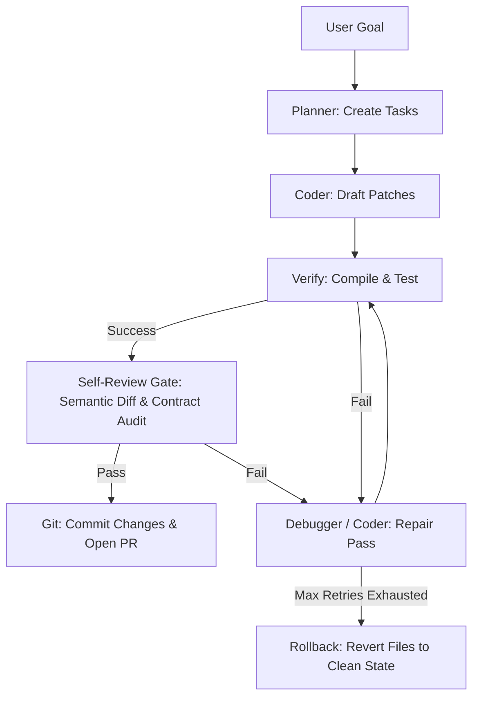

# Daedalus: Local-First AI Coding CLI & Agent Orchestrator

Daedalus (published on npm as `daedalus-cli`) is a local-first AI coding companion and multi-agent developer workbench. It runs locally on your machine, leveraging local or cloud-based Large Language Models (LLMs) to plan, execute, debug, and verify software engineering tasks while keeping your code and intellectual property completely private.

<p align="center">
  
</p>

---

## Core Philosophy & Design

* **Local-First & Private**: Integrates with local LLM providers (LM Studio, Ollama, llama.cpp, vLLM, FreeLLMAPI) so that your source code does not leave your local network. It can also route to cloud providers (OpenAI, Anthropic, Gemini, Groq) if configured.
* **Multi-Agent Orchestration**: Instead of a single LLM trying to solve complex tasks in one go, Daedalus delegates work to specialized autonomous sub-agents collaborating under a planner.
* **Loop Engineering & Verifiability**: Unlike models that edit code and hope it works, Daedalus runs stack-aware verification checks (compiling, linting, unit testing) after every edit and automatically repairs syntax errors or rolls back files on failure.
* **Self-Review Gate & Qodo-Level Audits**: Includes a pre-commit AI semantic diff gate that inspects code for logic errors, JSDoc contract mismatches, and `AGENTS.md` comment rule violations before committing.
* **Premium UX**: Runs as a simple terminal command line or a rich terminal user interface (TUI) featuring real-time CPU/RAM gauges and dynamic file-tree context selectors.

---

## 1. System Architecture & Agent Roles

Daedalus coordinates five specialized sub-agents to divide and conquer coding goals:

* **Planner**: Explores requirements, creates step-by-step task lists, and determines acceptance criteria for verification.
* **Coder**: Writes new files, makes surgical edits using a patch tool, and executes shell scripts.
* **Researcher**: Explores the local workspace, reads documentation, and searches the web.
* **Debugger**: Runs test suites, analyzes error logs, and corrects syntax/logic failures.
* **Reviewer**: Reviews pull requests, runs security checks, verifies JSDoc contract alignment, and validates styles/formatting.

### Loop Engineering Lifecycle



---

## 2. Key Features

### 1. Embedded Model Router, Tier Selection & Multi-Model Fallback Chain
Daedalus features an embedded model router that handles failover, round-robin, priority, or fastest-response load balancing across local and remote LLMs.
* **Model Tiers**: Configurations divide models into tiers (`intelligence`, `standard`, `fast`). High-effort tasks (planning, code reviews) route to intelligence models (e.g., GPT-4o, Claude 3.5 Sonnet, FreeLLMAPI), while simple edits route to standard/fast local models.
* **Multi-Model Fallback Chain**: If a provider returns a rate-limit (429), timeout, or 5xx server error, the router automatically fails over to the next candidate model in the chain without interrupting active user sessions or agent execution loops.

### 2. Autonomous Finn Loop (`daedalus --loop`)
* Interactive requirements specification via `/spec`.
* Automated polling of GitHub Issues with `daedalus-todo` labels.
* End-to-end multi-agent orchestration, automated testing, and pre-commit review gates.
* Automatic branch creation (`daedalus-issue-X`) and GitHub Pull Request creation.

### 3. Headless CI/CD PR Reviewer (`daedalus --ci`)
* Runs headless in GitHub Actions or locally (`daedalus --ci <pr-number>`).
* Executes static type-checking (`npx tsc`), linting (`npm run lint`), and unit test suites (`npm test`).
* Performs AI semantic diff analysis to catch logic bugs and JSDoc contract violations.
* Posts structured markdown review reports directly to GitHub PR comments.

### 4. Discord Bot & Webhook Integrations
* Built-in Discord Bot engine (`npm run bot`) featuring live version and release notes self-awareness.
* Rich color-coded Discord webhook embeds for spec queuing, loop work starts, self-review alerts, and PR readiness.

---

## 3. Real-World Case Study: Autonomous Finn Loop & Headless CI Review Pipeline

This case study documents an authentic, end-to-end execution of the **Daedalus Autonomous Finn Loop** (`daedalus --loop`) and **Headless CI Reviewer** (`daedalus --ci`), building and reviewing a real feature from interactive specification to GitHub Pull Request.

### Architectural Workflow

```mermaid
sequenceDiagram
    autonumber
    actor Dev as Developer
    participant Spec as "/spec Command"
    participant Issue as "GitHub Issue #15"
    participant Loop as "Daedalus Loop Daemon"
    participant Gate as "Self-Review Gate"
    participant PR as "GitHub PR #16"
    participant CI as "Headless CI Reviewer"

    Dev->>Spec: Run /spec for version validator
    Spec-->>Dev: Asks 3 clarification questions
    Dev->>Spec: Answers format, returns, and tests
    Spec->>Issue: Creates Issue #15 (tagged daedalus-todo)

    Loop->>Issue: Polls & detects Issue #15 (marks in-progress)
    Loop->>Loop: Multi-agent orchestration (Coder: version.ts + tests)
    Loop->>Gate: Runs Self-Review Gate (diff & lint audit)
    Gate-->>Loop: Pass confirmed

    Loop->>PR: Pushes branch daedalus-issue-15 & opens PR #16
    
    Dev->>CI: Run daedalus --ci 16
    CI->>CI: Runs tsc, lint, test & AI semantic diff
    CI->>PR: Posts official review comment (#16)
```

### Stage 1: Interactive Requirement Specification (`/spec`)
* **Session ID:** `session-1785387334336-a7b718`
* **Target:** GitHub Issue [#15](https://github.com/bgill55/daedalus/issues/15)
* User issues `/spec "Add a helper function to validate version string format and export it in version.ts"`.
* System asks 3 interactive clarification questions (version pattern, return type, test requirements).
* Automatically generates **GitHub Issue #15** tagged with `daedalus-todo`.

### Stage 2: Autonomous Daemon Execution (`daedalus --loop`)
* Daemon polls GitHub, detects Issue #15, and dispatches a **⚙️ Loop Work Started** Discord webhook embed.
* Multi-agent orchestrator delegates to Coder sub-agents to construct `src/version.ts` and `src/version.test.ts`.
* Verification engine runs `npx tsc --noEmit` and `npm run lint` (both pass!).
* **Self-Review Gate** executes AI semantic diff inspection, verifying code integrity.
* Automatically creates branch `daedalus-issue-15`, pushes to origin, and opens **GitHub PR #16**.
* Dispatches a **🚀 PR Ready** Discord embed with clickable links.

### Stage 3: Headless CI/CD Reviewer (`daedalus --ci 16`)
* Developer invokes `npx tsx src/index.ts --ci 16`.
* Performs headless static verification (`npx tsc`, `npm run lint`, `npm test`) and AI semantic diff analysis.
* Posts official automated review comment directly to [GitHub PR #16 (Issue Comment #5126853096)](https://github.com/bgill55/daedalus/pull/16#issuecomment-5126853096).

### Verified Deliverables
1. **`src/version.ts`**: Clean export of `isValidSemver(v: string): boolean` with JSDoc documentation.
2. **`src/version.test.ts`**: Comprehensive Vitest test suite covering valid SemVer strings (`1.93.0`, `0.0.0`, `1.93.0-canary`, `2.0.1-beta.2`) and invalid inputs.
3. **100% Automated Pipeline**: Zero manual code edits required—from `/spec` prompt to merge-ready PR comment!

---

## 4. Configuration Reference (`~/.daedalus/config.json`)

```json
{
  "version": 1,
  "router": {
    "strategy": "priority",
    "chain": [
      {
        "name": "freellmapi",
        "endpoint": "http://localhost:3001/v1",
        "model": "auto",
        "priority": 0,
        "enabled": true,
        "supportsTools": true,
        "tier": "intelligence"
      },
      {
        "name": "local-llm",
        "endpoint": "http://localhost:1234/v1",
        "model": "auto",
        "priority": 1,
        "enabled": true,
        "supportsTools": true,
        "tier": "intelligence"
      }
    ]
  },
  "agents": {
    "default": "coder",
    "autoOrchestrate": true
  },
  "ui": {
    "streaming": true,
    "showTokens": true,
    "theme": "dark",
    "tui": false,
    "collapseCommentary": true,
    "compactMode": true
  },
  "safety": {
    "protectGit": true,
    "autoApprove": false
  }
}
```

### Key Environment Variables
* `GITHUB_TOKEN` / `GH_TOKEN`: GitHub authentication token for PR creation and issue tracking.
* `DISCORD_WEBHOOK_URL` / `DISCORD_LOOP_WEBHOOK_URL`: Webhook URL for Discord status alerts and loop channel notifications.
* `DAEDALUS_AUTO_APPROVE`: When set to `true`, enables non-interactive auto-approval for terminal commands and reviewer repair passes.
