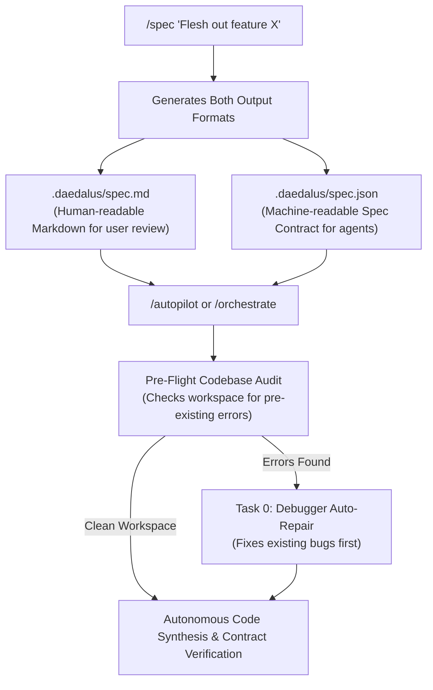
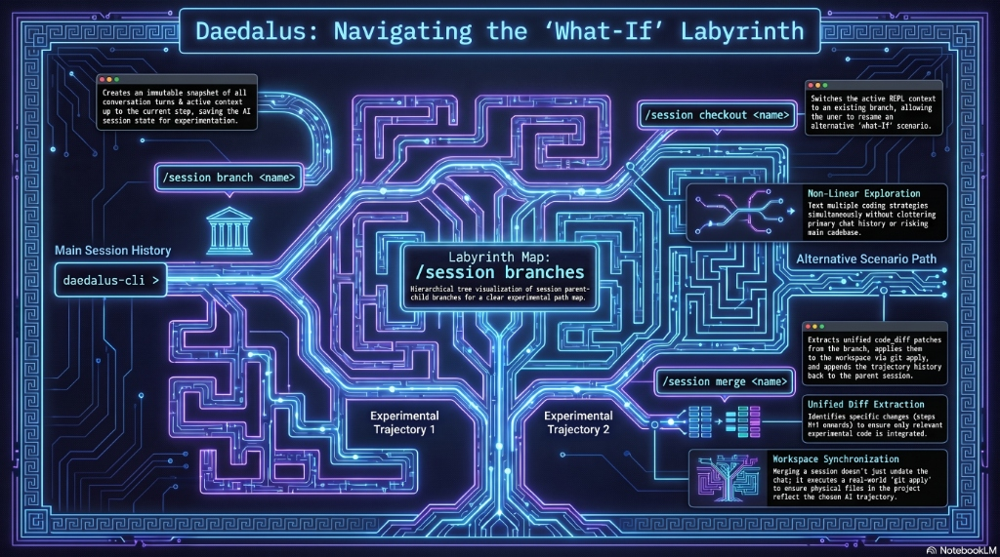

# Multi-Agent Orchestration & Task Control

Daedalus uses a multi-agent orchestration architecture to plan, delegate, execute, and verify complex coding goals. When you run `/orchestrate <goal>` (or its short aliases: `/orc`, `/run`, `/o`), the orchestrator coordinates sub-agents to divide and conquer the task.

---

## Agent Roles

The orchestrator manages six specialized sub-agents:

1.  **Spec**: Generates formal SpecFirst interface contracts (`.daedalus/spec.json` & `spec.md`), TypeScript schemas, and test assertions before coding.
2.  **Planner**: Outlines the plan, breaks down the main goal into bite-sized tasks, and defines verification criteria.
3.  **Coder**: Edits existing files, creates new files, and executes commands.
4.  **Researcher**: Explores the codebase, searches the web, and reads documentation.
5.  **Reviewer**: Evaluates code changes, security vulnerabilities, and confirms formatting requirements.
6.  **Debugger**: Runs tests, parses error logs, and corrects syntax or logic failures.

---

## Pre-Flight Codebase Audit & Task 0 Auto-Repair

Before executing feature tasks, Daedalus performs an automated **Pre-Flight Codebase Audit**. If existing code in the repository contains pre-existing TypeScript compilation or build errors, Daedalus automatically prepends **Task 0** to the plan:

```text
[ ] Task 0: [debugger] Fix pre-existing compilation/build error in codebase before implementing feature: ...
```

The `debugger` agent resolves all pre-existing syntax or type errors first, ensuring that new feature tasks are always built on a 100% healthy, bug-free codebase foundation.

---

## Unified SpecFirst Specification Workflow

Before code is generated, `/spec` compiles both human-readable Markdown and machine-readable type contracts:



---

## Orchestration Flow & Task Checklist

Upon starting, the orchestrator prints a dynamically wrapped task checklist representing the current plan:

*   `[ ]` **Pending**: Task is queued for execution.
*   `[▶]` **In Progress**: Active sub-agent is running the task.
*   `[✓]` **Completed**: Task completed successfully and changes were verified.
*   `[✗]` **Failed**: Task failed or exceeded its turn budget.
*   `[S]` **Skipped**: User chose to skip the task.

---

## Interactive Failure Checkpoints

If a sub-agent task fails or reaches its turn limit, the orchestrator pauses, displays the failed task, and prompts you to choose a recovery path:

```text
Task failed. Choose action: [r]etry / [e]dit / [s]kip / [a]bort
```

### Recovery Options

*   **`[r]etry`**: Re-runs the task with a clean turn budget. The orchestrator feeds the previous failure logs back to the agent so it can correct its mistake.
*   **`[e]dit`**: Prompts you to rephrase the task goal. This is useful when the agent gets confused, lacks specific instructions, or needs to target a concrete file path.
*   **`[s]kip`**: Skips the failed task and immediately moves on to the next task in the plan.
*   **`[a]bort`**: Halts the execution loop and saves the current state. The session is preserved, allowing you to manually inspect the workspace, modify files, or restart later.

---

## Session Resuming

If an orchestration is aborted or paused, the plan and its task progress are stored in the active session. 

*   To resume the orchestration, run the orchestrate command again: `/o`, `/orc`, or `/orchestrate`.
*   The CLI will detect the pending plan and prompt:
    `Would you like to resume it? [y]es / [n]o`
*   Resuming automatically restores the checklist, marks completed tasks as checked off, and starts execution on the first uncompleted task.

---

## Granular Task Planning

To ensure local models do not exhaust their context or turn budgets, the planner follows strict constraints:
*   Tasks are sized to fit within a **4-turn limit** for the coder agent.
*   Goals are broken down into discrete, file-scoped or function-scoped tasks rather than broad assignments (e.g., "Implement the video generator service in backend/video_service.py" instead of "Implement the backend").
*   Re-planning automatically dedupes completed file targets to prevent duplicate or circular task generation.

---

## Concurrent Background Execution

For independent subtasks, you can spawn background agents using the `/spawn` or `/delegate` commands with the `--bg` flag:

```text
o › /spawn --bg researcher "Find all usages of configDir in src/"
```

*   **Task Management**: View active background tasks via `/tasks`, view detailed logs/results via `/task <id>`, and cancel tasks using `/task kill <id>`.
*   **Prompt-Safe Notifications**: Notifications of completed background tasks are queued and printed right before your next REPL prompt redraw, ensuring your current active workspace is never interrupted.

---

## Loop Engineering: Draft-Verify-Repair & Rollbacks

Daedalus incorporates Loop Engineering principles into the multi-agent orchestrator to emulate the iterative workflow of human developers. This consists of three core phases: **Drafting**, **Verification**, and **Self-Repair / Rollback**.

### 1. Compile & Build Verification
After a Coder or Debugger agent completes a draft of changes, the orchestrator automatically runs a project-level verification check:
* **Auto-Discovery:** It scans the project root for compilation/test config files:
  * TypeScript/JavaScript: Checks for `"daedalus-check"` script in `package.json`, falling back to `npx tsc --noEmit` if `tsconfig.json` exists, or `npm run build`.
  * Rust: Checks for `Cargo.toml` and runs `cargo check`.
  * Go: Checks for `go.mod` and runs `go build ./...`.
* **Standard Verification:** The command is executed asynchronously. If it exits with an error code, the stdout/stderr error logs are captured.

### 2. Self-Correction & Repair Loops
If verification fails, the orchestrator triggers a repair loop:
* The error output (e.g., TS compiler type mismatches, syntax errors, missing dependencies) is dynamically appended to the agent's prompt context.
* The agent receives concrete error feedback (e.g., `"The build failed with this compiler warning: line 42..."`).
* The agent makes a new repair draft and is verified again.

### 3. Automated Workspace Rollback
If the agent fails to resolve the errors after all repair attempts are exhausted, the orchestrator automatically rolls back the changes:
* It reads the pre-patched content (`oldContent`) stored in the session's `patchHistory`.
* Reverts all files modified during this task in reverse order.
* Cleans up the workspace to ensure the codebase remains in a healthy, compiling state before prompting the user for intervention.

---

## Dynamic Sub-Agent Handoffs & Shared Context Variables

Inspired by OpenAI Swarm's ergonomic multi-agent orchestration, Daedalus supports mid-turn **Dynamic Sub-Agent Handoffs** and a shared **Context Variables** state bag:

### 1. Dynamic Sub-Agent Handoffs (`handoff_task`)
Any active agent can dynamically transfer the execution turn to another specialized sub-agent role without process restarts or losing conversation context:

* **Target Roles**: `planner`, `coder`, `reviewer`, `debugger`, `researcher`.
* **Handoff Notes**: Structured summary of what was accomplished and direct instructions for the next agent.
* **Context Updates**: Optional dictionary updates merged directly into the shared state bag.

```json
{
  "target_role": "reviewer",
  "handoff_notes": "Implemented JWT auth in src/auth.ts. Please audit for type-safety and unhandled exceptions.",
  "context_updates": {
    "target_files": ["src/auth.ts"],
    "tests_status": "green"
  }
}
```

### 2. Shared Context Variables (`set_context_variable` & `contextVariables`)
Agents can store and query structured key-value metadata across turns using the `set_context_variable` tool. This allows agents to pass persistent state (such as `pr_number`, `benchmark_score`, or `affected_modules`) across handoffs and turns without relying on raw transcript scraping.

---

## Single-Agent Auto-Routing (`route_task`)

In single-agent (REPL) mode the active agent can fan a large, multi-phase task out to helper sub-agents **without the user manually spawning them**. The agent stays the conductor: it proposes a routing plan, asks for permission, and only then delegates the independent pieces in parallel.

Flow:
1. The agent recognizes a big multi-phase task and calls `ask_user` to propose routing (e.g. *"This is a big task — want me to route the research to a researcher and the API contract to a planner in parallel?"*).
2. The user approves (or declines).
3. On approval, the agent calls `route_task` with `confirmed: true` and a `tasks` array of independent `{ role, goal }` pairs.
4. Each sub-task runs in its own role (planner, coder, reviewer, debugger, researcher) **in parallel** via `Promise.allSettled`, then reports back a consolidated `[ROUTED]` summary.
5. The agent synthesizes the results and finishes the user's original request.

The `confirmed` flag is a hard gate: calling `route_task` without `confirmed: true` is rejected, so sub-agents are never spawned without explicit user approval. Routing applies to single-agent REPL mode; multi-agent `/autopilot` orchestration uses the planner/executor path instead.

---

Daedalus supports non-linear session exploration. Rather than abandoning context when an experimental approach fails, you can snapshot, branch, checkout, and merge session trajectories.

<p align="center">
  
</p>

### Commands
* `/session branch <name>`: Create an immutable snapshot of conversation turns and active context up to the current step.
* `/session checkout <name>`: Switch active REPL session context to an existing branch.
* `/session branches`: Render a hierarchical tree diagram of all session branches and their status (`active`, `archived`, `merged`).
* `/session merge <name>`: Extract all `code_diff` patches from step $K+1$ onwards, execute `git apply` against the workspace, append conversation turns to the parent session history, and update the branch status to `merged`.

