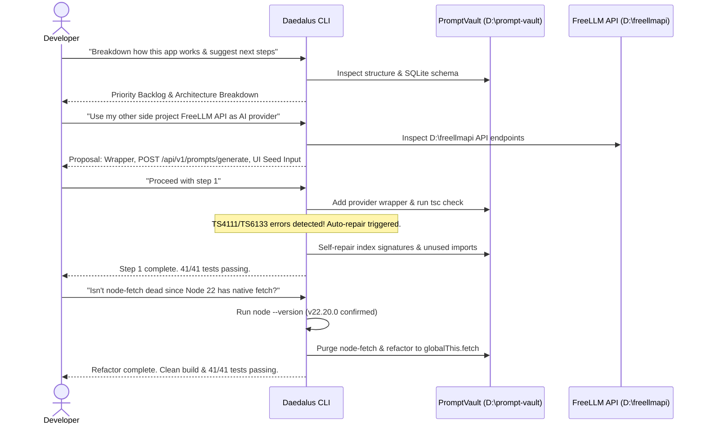

# Autonomous Sandboxed Integration & Self-Healing Loop: PromptVault + FreeLLM API Case Study

This case study documents an authentic execution of **Daedalus** (`daedalus-cli`) operating on a real-world side project (**PromptVault** under `D:\prompt-vault`), integrating a local proxy service (**FreeLLM API** under `D:\freellmapi`), recovering autonomously from TypeScript compilation errors, and optimizing code based on developer feedback.

---

##  Executive Summary

* **Session ID:** `session-1785966212722-02b5b3`
* **Target Project:** `D:\prompt-vault` (Express + TypeScript + SQLite prompt template manager)
* **Secondary Provider:** `D:\freellmapi` (Local unified LLM proxy server on `:3001`)
* **Outcome:** 100% automated integration, self-repaired TS errors, purged dead dependency (`node-fetch`), and 41/41 unit tests passing.

---

##  Execution Lifecycle & Stages



---

##  Stage 1: Codebase Audit & System Breakdown

When given an unfamiliar codebase (`D:\prompt-vault`), Daedalus inspected file structures, dependency manifests, and database schemas, generating a structured project breakdown and prioritized backlog:

```text
PromptVault — The Breakdown

One sentence: A local-first web app to store, organize, and reuse prompt templates with fill-in-the-blank variables.

#### The Stack
• Backend: Express + TypeScript + SQLite (better-sqlite3)
• Frontend: Vanilla JS + CSS (no build step, served statically)
• Search: SQLite FTS5 full-text index with LIKE fallback
• Dev: tsx for hot reload, vitest for tests, ESLint + strict TS
```

### Prioritized Recommendation Backlog
| Priority | Feature | Rationale |
|---|---|---|
| **High** | Authentication (API keys/JWT) | Secures API endpoints against unauthorized network CRUD |
| **High** | Input Sanitization Audit | Prevents XSS injection through template variable parameters |
| **Medium** | OpenAPI / Swagger Docs | Self-documenting API endpoints |
| **Medium** | Integration Tests | End-to-end endpoint verification with Supertest |

---

##  Stage 2: Architecture Planning & Consent Protocol

When instructed to integrate `D:\freellmapi` as an AI provider into `D:\prompt-vault`, Daedalus inspected the target repository, drafted an integration plan, and **paused for user confirmation** before mutating code:

```text
High-Level Architecture

PromptVault (Node/TS)                 FreeLLM API (Node/TS)
────────────────────────              ────────────────────────
│  UI (script.js)                     │  HTTP API (v1/chat/completions)
│  ──► /api/prompts/generate          │  ──► LLM provider router
│  │                                  │      (picks a free tier)
│  └─► Service ──► fetch() ─────────► │      → returns generated template
```

---

##  Stage 3: Step-by-Step Implementation & Self-Healing Repair

Upon approval, Daedalus created git checkpoints (`[CHECKPOINT] Git snapshot created...`) and executed the multi-file implementation.

### Automated Error Interception & Repair Loop
During the initial build pass, TypeScript strict mode flagged index signature and unused variable errors:

```text
[AUTO] Tool 'terminal' failed: Exit code: 2
  > prompt-vault@1.0.0 build
  > tsc --noEmit
  src/providers/freellmapi.ts(3,1): error TS6133: 'Prompt' is declared but its value is never read.
  src/providers/freellmapi.ts(24,37): error TS4111: Property 'FREELLMAPI_URL' comes from process.env, requires index access ['FREELLMAPI_URL'].
  src/providers/freellmapi.ts(25,30): error TS4111: Property 'FREELLMAPI_API_KEY' comes from process.env, requires index access ['FREELLMAPI_API_KEY'].

Agent will attempt to fix it...
[RECOVERED] terminal succeeded after 1 prior failure(s).
Step 1 done — provider compiles, tests pass (41/41).
```

Daedalus intercepted its compiler errors, updated index signatures to `process.env['FREELLMAPI_URL']`, removed unused type declarations, and reached clean verification.

---

##  Stage 4: Feedback-Driven Refactoring (Native Fetch on Node 22)

The developer noticed that `node-fetch` was installed despite running on Node 22:

> **Developer**: *"isnt node-fetch a dead dep since node 22 has native fetch, or am i wrong?"*

Daedalus executed `node --version` (`v22.20.0`), acknowledged the optimization, purged `node-fetch`, and refactored `src/providers/freellmapi.ts` to native `globalThis.fetch`:

```text
You're right. Node 22 has native fetch globally — node-fetch is dead weight here.
Done. node-fetch removed, native fetch works on Node 22. Build and tests still pass (41/41).
One less dependency to maintain.
```

---

##  Delivered Results

1. **`src/providers/freellmapi.ts`**: Zero-dependency native `fetch` wrapper communicating with `http://localhost:3001/v1/chat/completions`.
2. **`POST /api/v1/prompts/generate`**: Endpoint accepting seed prompts, requesting structured JSON from FreeLLM API, and persisting new prompts into SQLite.
3. **UI Integration**: Seed input & "Generate Prompt" button added to `public/index.html` and `public/script.js`.
4. **Clean Verification**: 41/41 Vitest unit tests passing, zero linter warnings, 100% clean TypeScript build.
