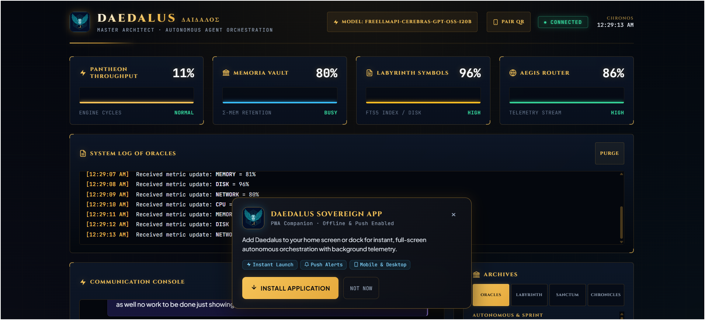

# Sovereign PWA Companion & Mobile Pairing

> *"Carry the sacred forge in your palm — sovereign autonomy, real-time telemetry, and zero cloud lock-in."*

Daedalus transforms your local coding environment into an installable **Progressive Web App (PWA)** and mobile companion. Whether monitoring multi-hour autonomous `/marathon` loops from your smartphone or steering `/autopilot` runs from a tablet, the PWA provides full bi-directional control over local Wi-Fi or Tailscale.

  
  

  <b>Unified Cyber-Mythic Experience:</b> Desktop PWA Dashboard &amp; Sovereign Mobile Companion

---

## Key Features

### 1. Zero-Cloud Sovereign Link
The companion server runs directly inside the Daedalus CLI process on port `3888` (binding to `0.0.0.0`). Your sessions, tokens, and code stay 100% on your local hardware — never relayed through third-party servers.

### 2. Instant Mobile Pairing via QR Code
1. Open the WebUI on your desktop (`/webui open`).
2. Click **PAIR QR** in the top header.
3. The server automatically detects your workstation's LAN IPv4 address (e.g., `192.168.x.x`) and generates a themed, high-contrast gold-and-obsidian QR code.
4. Scan the QR code with your phone camera to pair over your local Wi-Fi.

  

### 3. Progressive Web App (PWA) Architecture
* **Offline Shell**: Service worker (`sw.js`) caches application assets (`index.html`, `styles.css`, `script.js`, `manifest.json`) for instant launch.
* **Standalone Window**: Runs without browser address bars or navigation clutter.
* **Touch-Optimized HUD**: 48px minimum touch targets, gesture responsiveness, and compact horizontal card layouts tailored for narrow smartphone viewports.
* **Bespoke Gold SVG Iconography**: Crisp vector icons across gauges, buttons, and telemetry logs that render cleanly on all devices.

---

## Installation Guide

### Android (Google Pixel, Samsung Galaxy, etc.)
1. Open the WebUI URL in **Chrome**, **Brave**, or **Edge**.
2. Tap the **INSTALL APPLICATION** banner at the bottom (or open the browser menu `⋮` and select **Install app** / **Add to Home screen**).
3. The app will install with the gold Daedalus seal icon in your application drawer.

> **Note for Local HTTP**: Android Chrome enforces PWA installation over HTTPS or localhost. To enable full standalone PWA install over local LAN IP (`http://192.168.x.x:3888`), enable `chrome://flags/#unsafely-treat-insecure-origin-as-secure` on your mobile device, or use a secure tunnel (e.g. `cloudflared tunnel --url http://localhost:3888` or Tailscale).

### iOS (Apple iPhone & iPad)
1. Open the WebUI URL in **Safari**.
2. Tap the **Share** button (the square with an arrow pointing upward).
3. Scroll down and tap **Add to Home Screen**.
4. Name the app **Daedalus** and tap **Add**.
5. Launch directly from your home screen in full-screen standalone mode.

### Desktop (Windows, macOS, Linux)
1. Open `http://127.0.0.1:3888` in Chrome, Edge, or Brave.
2. Click the install icon in the address bar or click **INSTALL APPLICATION** on the prompt banner.
3. Daedalus will run in its own dedicated, native desktop window.

---

## Live Monitoring & Autonomous Steering

From the mobile companion, you can:
* **Consult with the Pantheon**: Execute sacred rites like `/health`, `/models`, `/marathon`, and `/autopilot`.
* **Inspect Real-Time Gauges**: Monitor Pantheon CPU throughput, Memoria RAM retention, Labyrinth FTS5 disk indexing, and Aegis router telemetry.
* **Browse Chronicles**: Restore and resume past agent sessions on demand.
* **Receive Push Notifications**: Get notified when autonomous marathon milestones pass Apollo evaluation.
