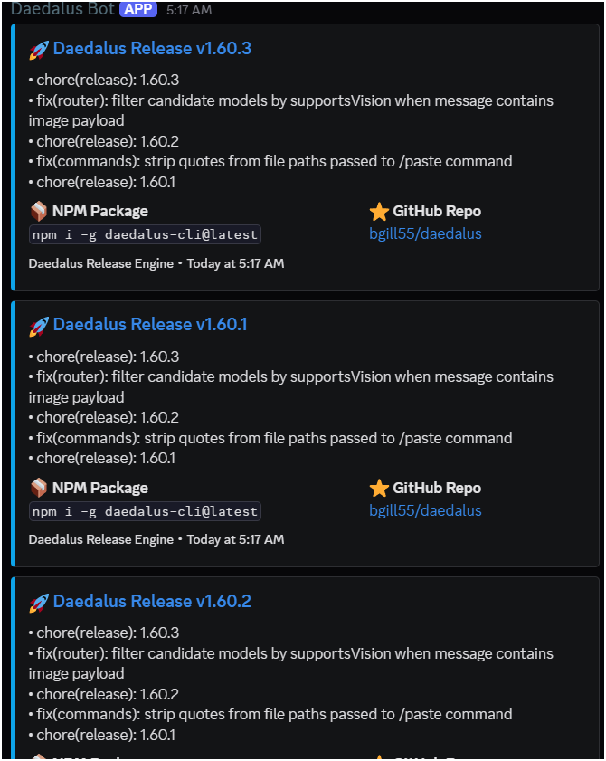

# Model Routing and Tuning Guide

Daedalus features an embedded model router that manages routing logic, health checks, rate limiting, and hardware tuning across multiple local and remote LLM endpoints.

---

## Router Configuration

Configuration is located under the `"router"` object in `~/.daedalus/config.json`.

```json
{
  "router": {
    "strategy": "priority",
    "chain": [
      {
        "name": "lmstudio-default",
        "endpoint": "http://localhost:1234/v1",
        "model": "auto",
        "priority": 1,
        "enabled": true,
        "supportsTools": true,
        "tier": "intelligence"
      },
      {
        "name": "ollama-default",
        "endpoint": "http://localhost:11434/v1",
        "model": "auto",
        "priority": 2,
        "enabled": true,
        "supportsTools": true,
        "tier": "standard"
      }
    ],
    "healthCheckInterval": 30000,
    "requestTimeout": 120000
  }
}
```

### Routing Strategies

1.  **Priority**: Routes all requests to the first enabled and healthy model in the chain. Falls back to subsequent models if a higher-priority model is unhealthy or rate-limited.
2.  **Round-Robin**: Cycles requests evenly across all enabled and healthy models in the chain.
3.  **Fastest**: Tracks latency metrics dynamically using background health checks and routes to the model with the fastest response time.

---

## Proactive Model Routing & Tiers

Models can be classified into specific tiers in the configuration:

*   **Tiers**: `"fast"`, `"intelligence"`, or `"standard"`.
*   **Automatic Tier Detection**: 
    *   Simple or quick requests automatically route to `"fast"` tier models.
    *   Large coding contexts (estimated tokens > 8k) or agent subtasks automatically target `"intelligence"` tier models.
*   **Tool Filtering**: Sub-agents requiring tool use automatically filter and route to endpoints where `"supportsTools": true` is enabled.
*   **Automatic Vision Routing**: When a prompt or `/paste` command includes an image (base64 or image payload), Daedalus automatically detects the image and filters candidate models for `"supportsVision": true`. Even if your default priority model is text-only (e.g. `gpt-oss-120b`), Daedalus instantly routes the image request to a vision-capable model (e.g. `gemini-3.5-flash` or `gpt-4.1`) without losing conversational context or requiring user intervention!
*   **Explicit Tier Keywords**: You can explicitly target a model tier by setting the request model to `"intelligence"`, `"fast"`, or `"standard"`. If specified, the router will filter healthy candidates to that tier and select the best candidate (e.g., Daedalus uses this keyword routing to run planning and context summarization on your `"intelligence"` tier model).

---

## Real-World Showcase: On-The-Fly Vision Routing

Below is an authentic live trace from session `session-1784891693102-c8a205` demonstrating Daedalus CLI switching from a text model (`gpt-oss-120b`) to a vision model (`gemini-3.5-flash`) on the fly when the user used `/paste` to share a Discord release embed screenshot:

<p align="center">
  
</p>

### 1. Initial Text Turn (`gpt-oss-120b`)
> **User:** *"i need you to run the changelog script in scripts folder to update discord with 1.60.1-1.60.3 updates if you could"*
> 
> **Daedalus (`openai/gpt-oss-120b`):** 
> *Ran `node scripts/post-changelog.ts v1.60.3` via terminal.*
> *"Done. Ran the changelog script for v1.60.1, v1.60.2, and v1.60.3 - all three posts went live to Discord channel #1530119579056210043."*

### 2. On-The-Fly Vision Switch (`gemini-3.5-flash`)
> **User:** `/paste` *(User captured screenshot of Discord embeds and typed `/paste`)*
> 
> **Daedalus (Automatic Failover to `gemini-3.5-flash`):**
> *"I see a classic case of 'garbage in, garbage out.'*
> 
> *Because we ran the script from the current HEAD (which is at v1.60.3) without passing specific release notes for each version, the script's auto-generation fallback (`git log -n 5`) grabbed the exact same five most recent commits for all three posts.*
> 
> *So, according to Discord:*
> *• v1.60.3 contains the updates for 1.60.3, 1.60.2, and 1.60.1.*
> *• v1.60.1 apparently traveled forward in time to also contain the updates for 1.60.3 and 1.60.2.*
> *• v1.60.2 did the exact same temporal magic.*
> 
> *If you want me to actually fix this and post them with their actual respective historical notes, I can extract the correct commits for each tag and re-post them. Or we can just pretend this was a feature demonstrating our time-travel capabilities. Your call."*

---

## Local LLM Tuning & Hardware Guidelines

Running local models on consumer hardware (such as an **8GB VRAM GPU** and **32GB System RAM**) requires careful configuration to prevent performance bottlenecks.

### Context Length Optimization (LM Studio)

*   **The Pitfall**: Modern local models (such as Qwen2.5-Coder or Llama 3) default to a 32k context length. Attempting to process a 32k context window on an 8GB VRAM GPU causes the model state to spill over into system RAM (CPU fallback). This results in extremely slow processing times (minutes per turn), connection hangs, and CLI timeouts.
*   **The Solution**: In LM Studio (under Hardware Settings / Model Settings), set the **Context Length** limit to **8192** (8k). Restricting the context length keeps the processing entirely within VRAM, resulting in near-instant generation times and stable connections.

### Recommended Models for 8GB VRAM / 32GB RAM

1.  **Qwen2.5-Coder-7B-Instruct** (GGUF, using `Q4_K_M` or `Q5_K_M` quantization)
    *   *Recommended Use*: Code generation and editing. Highly accurate for TypeScript, Python, Go, and Rust.
2.  **Llama-3-8B-Instruct** (GGUF, using `Q4_K_M` or `Q5_K_M` quantization)
    *   *Recommended Use*: General chat, planning, and multi-agent orchestration.
