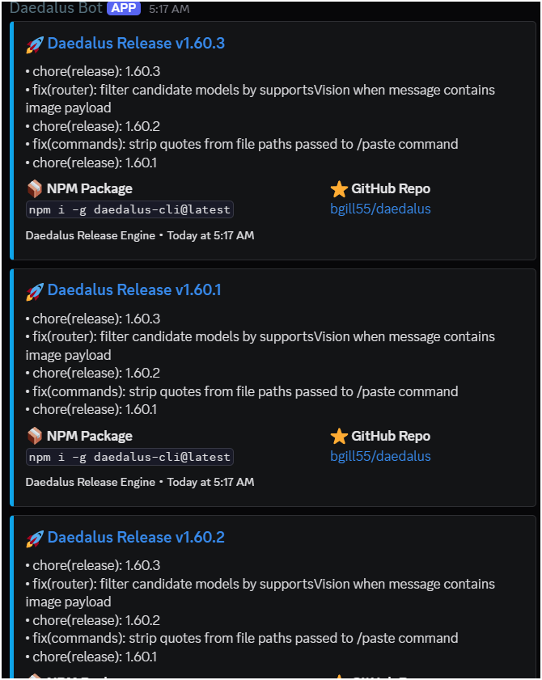

# Model Routing and Tuning Guide

Daedalus features an embedded model router that manages routing logic, health checks, rate limiting, and hardware tuning across multiple local and remote LLM endpoints.

---

## Router Configuration

Configuration is located under the `"router"` object in `~/.daedalus/config.json`.

```json
{
  "router": {
    "strategy": "priority",
    "autoEscalate": true,
    "complexityRouting": true,
    "chain": [
      {
        "name": "lmstudio-default",
        "endpoint": "http://localhost:1234/v1",
        "model": "auto",
        "priority": 1,
        "enabled": true,
        "supportsTools": true,
        "tier": "intelligence"
      },
      {
        "name": "ollama-default",
        "endpoint": "http://localhost:11434/v1",
        "model": "auto",
        "priority": 2,
        "enabled": true,
        "supportsTools": true,
        "tier": "standard"
      }
    ],
    "healthCheckInterval": 30000,
    "requestTimeout": 120000
  }
}
```

### Routing Strategies

1.  **Priority**: Routes all requests to the first enabled and healthy model in the chain. Falls back to subsequent models if a higher-priority model is unhealthy or rate-limited.
2.  **Round-Robin**: Cycles requests evenly across all enabled and healthy models in the chain.
3.  **Fastest**: Tracks latency metrics dynamically using background health checks and routes to the model with the fastest response time.

---

## Multi-Model Fallback Chain

Daedalus includes an automatic multi-model failover engine. If a provider returns a rate-limit (429), timeout, or 5xx server error during text completion or streaming:
* The failing provider is marked unhealthy and temporarily excluded.
* Daedalus immediately fails over to the next candidate model in your router chain without throwing errors or breaking your active session.
* Output streaming and sub-agent execution continue seamlessly.

---

## Dynamic Complexity-Based Routing

Models are classified into **tiers** in the router chain: `"fast"`, `"standard"`, or `"intelligence"`. Daedalus then routes each task to the tier that matches its actual difficulty — and, crucially, **re-routes on the fly** when the difficulty changes mid-task.

*   **Tiers**: `"fast"`, `"standard"`, `"intelligence"` (set per model via `tier` in the chain).
*   **Task classification at arrival**: when you send a prompt, Daedalus estimates its complexity up front:
    *   `simple` (quick edits — "add a comma", "fix the typo") → `fast` tier.
    *   `standard` (medium, ambiguous prompts) → `standard` tier.
    *   `complex` (multi-file work, 3+ file paths, heavy prompts, or keywords like `refactor`, `implement`, `architect`, `migrate`, `overhaul`) → `intelligence` tier.
*   **On-the-fly reclassification**: after every tool turn Daedalus re-evaluates the live signals and can shift tiers mid-task:
    *   **Upgrade** when cumulative output grows heavy, a tool chain exceeds 20 calls, or a turn produces 3+ tool failures.
    *   **Downgrade** when the task goes quiet — 3 consecutive turns with no writes, no failures, and low output — using hysteresis so a single quiet turn doesn't flap the tier.
    *   The cumulative-token budget **resets on every downgrade**, so past heavy output can't instantly force a re-upgrade (no ping-pong between tiers).
*   **Escalation on repeated failures**: after repeated tool failures, Daedalus escalates to the *next* model in the chain and pins it for the rest of the task (skips disabled/unhealthy/non-tool models). `router.autoEscalate` (default `true`) controls this.
*   **Automatic tier keywords**: you can also target a tier explicitly by using `"intelligence"`, `"fast"`, or `"standard"` as the request model — Daedalus filters healthy candidates to that tier and picks the best one. (This is how planning and context summarization stay on your `intelligence` tier.)
*   **Tool filtering**: agents requiring tool use automatically filter to endpoints with `"supportsTools": true`.
*   **Vision routing**: prompts or `/paste` images auto-detect and route to `"supportsVision": true` models (e.g. `gemini-3.5-flash`) even when the priority model is text-only.

### Control & Telemetry

| Config key | Default | Effect |
|---|---|---|
| `router.complexityRouting` | `true` | Enable/disable dynamic complexity-based routing entirely. |
| `router.autoEscalate` | `true` | Enable escalation to the next chain model after repeated tool failures. |
| `modelOverride` | — | Pin a single model and bypass routing, classification, and escalation. Set via `/config set modelOverride = <model>` or `/model`. |

While working, Daedalus prints `[ROUTE]` lines so you can see the router thinking:

```
  [ROUTE] Task classified as simple
  [ROUTE] Reclassified standard → complex (11764 output tokens, 35 tool calls)
  [ROUTE] Task summary: start complex → end complex | 11764 output tokens | 0 escalation(s)
```

Each assistant block footer also tags the tier that served it:

```
  └ standard · freellmapi-command-a-reasoning-08-2025 · 3 tool(s) · 2.1k out · 12.4s
```

---

## Real-World Showcase: On-The-Fly Tier Switching

Authentic live trace — one session, two prompts, two completely different tiers. A trivial request stays on a fast flash model; a "refactor" request starts on the intelligence tier, then dynamically migrates between tiers as the actual workload becomes clear:

**Prompt 1 — trivial edit → `fast` tier:**

```
  [ROUTE] Task classified as simple
  └ fast · freellmapi-gemini-2.5-flash (gemini-2.5-flash) · 1 tool(s) · 57 out · 2.3s · 24.7 tok/s
  [ROUTE] Task summary: start simple → end simple | 0 output tokens | 0 escalation(s)
```

**Prompt 2 — heavy refactor → `intelligence` tier, then dynamic re-routing as the task evolves:**

```
  [ROUTE] Task classified as complex
  [ROUTE] Reclassified complex → standard (182 output tokens, 3 tool calls)
  [ROUTE] Reclassified standard → simple (362 output tokens, 10 tool calls)
  [ROUTE] Reclassified simple → standard (2744 output tokens, 17 tool calls)
  [ROUTE] Reclassified standard → complex (11764 output tokens, 35 tool calls)
  [ROUTE] Task summary: start complex → end complex | 11764 output tokens | 0 escalation(s)
```

The second task began on the intelligence tier, dropped to the fast tier once the early turns looked trivial, then climbed back to the intelligence tier as real writes and heavy output accumulated — all without user intervention.

---

## Real-World Showcase: On-The-Fly Vision Routing

Below is an authentic live trace from session `session-1784891693102-c8a205` demonstrating Daedalus CLI switching from a text model (`gpt-oss-120b`) to a vision model (`gemini-3.5-flash`) on the fly when the user used `/paste` to share a Discord release embed screenshot:

<p align="center">
  
</p>

### 1. Initial Text Turn (`gpt-oss-120b`)
> **User:** *"i need you to run the changelog script in scripts folder to update discord with 1.60.1-1.60.3 updates if you could"*
> 
> **Daedalus (`openai/gpt-oss-120b`):** 
> *Ran `node scripts/post-changelog.ts v1.60.3` via terminal.*
> *"Done. Ran the changelog script for v1.60.1, v1.60.2, and v1.60.3 - all three posts went live to Discord channel #1530119579056210043."*

### 2. On-The-Fly Vision Switch (`gemini-3.5-flash`)
> **User:** `/paste` *(User captured screenshot of Discord embeds and typed `/paste`)*
> 
> **Daedalus (Automatic Failover to `gemini-3.5-flash`):**
> *"I see a classic case of 'garbage in, garbage out.'*
> 
> *Because we ran the script from the current HEAD (which is at v1.60.3) without passing specific release notes for each version, the script's auto-generation fallback (`git log -n 5`) grabbed the exact same five most recent commits for all three posts.*
> 
> *So, according to Discord:*
> *• v1.60.3 contains the updates for 1.60.3, 1.60.2, and 1.60.1.*
> *• v1.60.1 apparently traveled forward in time to also contain the updates for 1.60.3 and 1.60.2.*
> *• v1.60.2 did the exact same temporal magic.*
> 
> *If you want me to actually fix this and post them with their actual respective historical notes, I can extract the correct commits for each tag and re-post them. Or we can just pretend this was a feature demonstrating our time-travel capabilities. Your call."*

---

## Local LLM Tuning & Hardware Guidelines

Running local models on consumer hardware (such as an **8GB VRAM GPU** and **32GB System RAM**) requires careful configuration to prevent performance bottlenecks.

### Context Length Optimization (LM Studio)

*   **The Pitfall**: Modern local models (such as Qwen2.5-Coder or Llama 3) default to a 32k context length. Attempting to process a 32k context window on an 8GB VRAM GPU causes the model state to spill over into system RAM (CPU fallback). This results in extremely slow processing times (minutes per turn), connection hangs, and CLI timeouts.
*   **The Solution**: In LM Studio (under Hardware Settings / Model Settings), set the **Context Length** limit to **8192** (8k). Restricting the context length keeps the processing entirely within VRAM, resulting in near-instant generation times and stable connections.

### Recommended Models for 8GB VRAM / 32GB RAM

1.  **Qwen2.5-Coder-7B-Instruct** (GGUF, using `Q4_K_M` or `Q5_K_M` quantization)
    *   *Recommended Use*: Code generation and editing. Highly accurate for TypeScript, Python, Go, and Rust.
2.  **Llama-3-8B-Instruct** (GGUF, using `Q4_K_M` or `Q5_K_M` quantization)
    *   *Recommended Use*: General chat, planning, and multi-agent orchestration.
