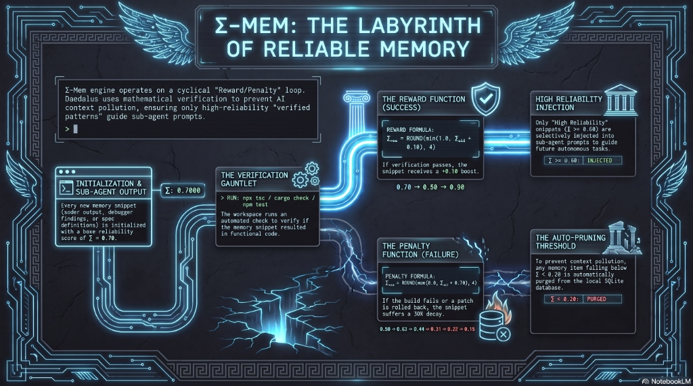
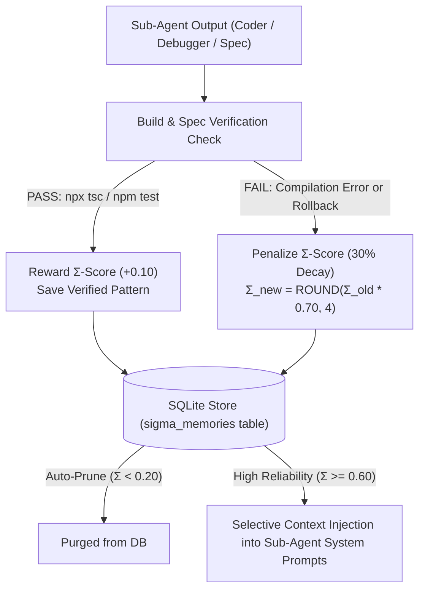

# 🧠 $\Sigma$-Mem ($\Sigma$-Memory): Reliable Multi-Agent Memory Engine

Daedalus features an embedded, local-first **$\Sigma$-Mem ($\Sigma$-Memory)** engine that solves the "context pollution" problem in multi-agent systems. Rather than storing flat, unverified chat transcripts, $\Sigma$-Mem scores, rewards, decays, and prunes sub-agent knowledge based on **verification feedback** (compilation, linting, unit test results, and SpecFirst contract assertions).

<p align="center">
  
</p>

---

## 💡 The Core Problem: Flat Memory vs. $\Sigma$-Mem

In traditional multi-agent systems:
- **Flat Memory**: Retains all conversation turns — including hallucinated APIs, syntax errors, and failed attempts — equal to correct code. Over long autonomous tasks, the context window fills with noise, causing performance decay.
- **$\Sigma$-Mem Solution**: Evaluates memory snippets dynamically. Knowledge that contributes to **passing build checks** is rewarded with higher reliability scores ($\Sigma$-score), while knowledge associated with failed attempts decays and gets automatically pruned.

---

## ⚙️ How $\Sigma$-Mem Works



---

## 📊 Reliability Scoring Math

Every memory item maintains a floating-point score $\Sigma \in [0.0, 1.0]$, initialized at **$0.70$**.

### 1. Reward Function (Build Verification Success)
When code produced using a memory item passes verification:
$$\Sigma_{new} = \text{ROUND}(\min(1.0, \Sigma_{old} + 0.10), 4)$$

### 2. Penalty Function (Build Verification Failure / Patch Rollback)
When code produced using a memory item fails build verification:
$$\Sigma_{new} = \text{ROUND}(\max(0.0, \Sigma_{old} \times 0.70), 4)$$

### 3. Auto-Pruning Threshold
Any memory item whose score falls below the threshold is automatically purged from the SQLite database:
$$\text{Purge if } \Sigma < 0.20$$

---

## 🗄️ SQLite Database Schema

$\Sigma$-Mem runs 100% locally inside `.daedalus/sessions/<session_id>.sqlite` without requiring external vector databases or Redis servers:

```sql
CREATE TABLE IF NOT EXISTS sigma_memories (
  id TEXT PRIMARY KEY,
  agent_role TEXT NOT NULL,       -- 'coder' | 'debugger' | 'reviewer' | 'planner'
  category TEXT NOT NULL,         -- 'code_pattern' | 'fix_resolution' | 'schema_contract' | 'build_rule'
  tags TEXT NOT NULL,              -- JSON array of file paths / keywords
  summary TEXT NOT NULL,
  content TEXT NOT NULL,
  content_hash TEXT NOT NULL UNIQUE,  -- sha256(agent_role|category|summary), dedup key
  sigma_score REAL NOT NULL DEFAULT 0.70,
  usefulness_count INTEGER DEFAULT 0,
  decay_count INTEGER DEFAULT 0,
  created_at INTEGER NOT NULL,
  updated_at INTEGER NOT NULL
);
CREATE INDEX IF NOT EXISTS idx_sigma_score ON sigma_memories(sigma_score DESC);
CREATE UNIQUE INDEX IF NOT EXISTS idx_sigma_content_hash ON sigma_memories(content_hash);
```

---

## 🧬 Robustness Features (v3.1)

The engine was hardened with four mechanisms so its knowledge base stays compact, current, and relevant.

### 1. Content-Hash Deduplication

Every recorded memory computes a canonical hash — `sha256(agent_role|category|summary)` — stored in `content_hash`. Recording the same fact twice **upserts** instead of inserting a new row:

- tags and `content` are refreshed,
- `usefulness_count` is incremented by 1,
- `sigma_score` is bumped by `+0.05` (capped at `1.0`),
- the original `id` is preserved.

Repeatedly re-verified knowledge therefore rises in reliability instead of silently polluting the store with near-duplicate rows. Existing databases are migrated in place with a partial unique index on non-null hashes.

### 2. Tag-Based Retrieval

`getPromptContext(db, role?, minScore?, limit?, matchTags?)` accepts an optional list of file paths / keywords. Memories whose stored `tags` overlap the requested tags are **ranked first**, so context injection favors knowledge that is relevant to the task at hand. Non-overlapping memories are still included as fallback once the budget is exhausted. The orchestrator passes the goal's extracted file paths; the single-agent REPL passes the session's active context files.

### 3. Time Decay

Scores decay exponentially with a **30-day half-life**:

$$\Sigma_{decayed} = \max(0.20,\ \Sigma \times 0.5^{\,days/30})$$

`updated_at` is only written when the decayed delta is material (`> 0.005`), and `decay_count` tracks how many times decay was applied. Memories are auto-pruned below `0.20`. Stale but once-useful knowledge therefore fades gradually instead of being prematurely discarded.

### 4. Category Selection & Feedback Attribution

Category is derived from the task and role (`pickMemoryCategory`): debugger tasks → `fix_resolution`, reviewer → `build_rule`, planner → `schema_contract`, otherwise `code_pattern`.

Reward and penalty are now **attributed**: on failure only memories whose tags overlap the current task are penalized; on success the overlapping set is rewarded (falling back to the full active set when none overlap).

### 5. Single-Agent Mode

The REPL injects the Σ-Mem context block into the main system prompt, refreshed each turn. After every model turn, `evaluatePatchOutcome` compares patch progress and failure streaks; a turn that applied new patches rewards the active memories, one that worsened failures penalizes them. Feedback is best-effort (never breaks the turn) and **never records new knowledge** from this weak proxy signal — single-agent turns only score existing memories, while the orchestrator remains the sole recorder of verified knowledge.

---

## 💻 CLI Commands & Usage

Inspect active $\Sigma$-Memories, scores, and decay counts directly in your terminal:

```bash
# View active memories with default minimum score threshold (>= 0.50)
/sigma

# Alias for /sigma
/memory

# Filter memories by a custom minimum Σ-Score threshold (e.g., >= 0.70)
/sigma 0.70
```

### Example Terminal Output

```text
=== 🧠 Σ-MEM (RELIABILITY-SCORED AGENT KNOWLEDGE) ===
  [Σ-Score: 90%] [CODER] SVG layout protection rule
    Used: 3 | Decays: 0 | Content: Always set max-width: 24px on raw svg tags...

  [Σ-Score: 80%] [DEBUGGER] Express static path resolution
    Used: 2 | Decays: 0 | Content: Use path.join(process.cwd(), 'public')...
===================================================
```
