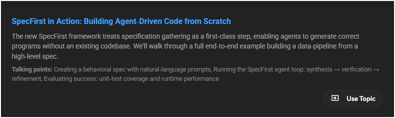
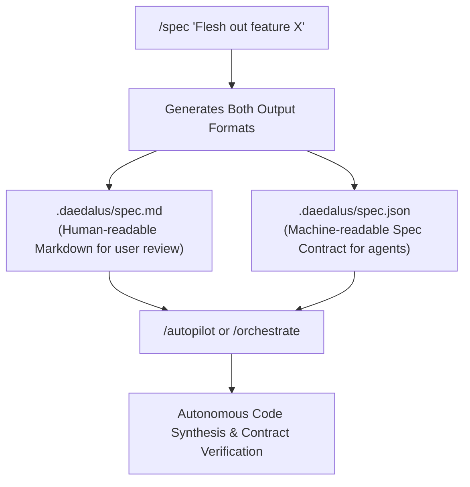

# SpecFirst Architecture & Verification Engine

Daedalus includes a built-in **SpecFirst Architecture** that enforces formal specification gathering, type contracts, and automated assertion verification before code is written or committed.

<p align="center">
  
</p>

<p align="center">
  <video src="media/Daedalus_SpecFirst.mp4" width="100%" controls></video>
</p>

---

## Why SpecFirst?

When building new software components or complex features with AI coding agents:
1. **Contract Drift:** Without upfront specs, sub-agents building separate files (`types.ts` vs `component.tsx`) can mismatch function parameter names or prop types.
2. **Untested Assertions:** Code might compile syntactically, but miss critical behavioral edge cases.
3. **Goal Drift:** Without a pre-compiled specification, sub-agents lose sight of the target contracts during multi-step tasks.

The **SpecFirst Engine** solves this by inserting a mandatory **Specification Gathering & Verification Gate** before and after code synthesis.

---

## Unified Specification Workflow

When you ask Daedalus to flesh out an idea with `/spec`, it generates **both** human-readable Markdown (`spec.md`) and machine-readable JSON type contracts (`spec.json`) in one unified step:



---

## How It Works: The 4-Stage SpecFirst Lifecycle

```
┌─────────────────────────┐
│ 1. Spec Gathering       │  Query router to create .daedalus/spec.json & spec.md
└───────────┬─────────────┘
            │
┌───────────▼─────────────┐
│ 2. Contract Injection   │  Inject formatSpecForPrompt() into all sub-agent prompts
└───────────┬─────────────┘
            │
┌───────────▼─────────────┐
│ 3. Parallel Synthesis   │  Sub-agents (coder, planner, reviewer) code against exact spec
└───────────┬─────────────┘
            │
┌───────────▼─────────────┐
│ 4. Spec Verification    │  runBuildVerification() validates TypeScript + spec test cases
└─────────────────────────┘
```

---

## 1. Upfront Spec Generation (`/spec generate <goal>`)

Before the `coder` or `planner` agent writes code, Daedalus generates a structured specification (`.daedalus/spec.json` and `.daedalus/spec.md`).

### Example `.daedalus/spec.json` Structure:
```json
{
  "featureName": "System Stats Utility",
  "summary": "Utility for retrieving system memory and disk usage metrics",
  "interfaces": [
    {
      "name": "MemoryStats",
      "filePath": "src/types/sys-stats.ts",
      "code": "export interface MemoryStats { total: number; free: number; used: number; }"
    }
  ],
  "functions": [
    {
      "name": "getMemoryUsage",
      "signature": "() => MemoryStats",
      "filePath": "src/utils/sys-stats.ts",
      "description": "Returns current system memory metrics"
    }
  ],
  "testCases": [
    {
      "name": "Verify file existence",
      "description": "Ensure src/utils/sys-stats.ts is created",
      "assertionType": "file_exists",
      "targetFile": "src/utils/sys-stats.ts"
    }
  ],
  "verificationCommands": ["npx tsc --noEmit", "npm test"]
}
```

---

## 2. CLI Commands & Usage

### Slash Commands:

- **`/spec generate <goal>`**: Generates `.daedalus/spec.json` & `.daedalus/spec.md` locally without starting orchestration.
- **`/spec view`**: Displays the active feature contract and test criteria.
- **`/spec <goal>`**: Generates spec contract and creates a GitHub issue for loop processing.
- **`/autopilot <goal>`**: Automatically executes the SpecFirst contract phase before planning and coding.

---

## 3. Automated Spec Verification

During the verification stage (`orchestrator-verification.ts`), Daedalus runs `verifySpecAssertions()` alongside standard build checks (`npx tsc --noEmit` and `npm test`):

- **File Existence Checks**: Verifies all required contract target files exist.
- **Export & Interface Assertions**: Verifies that required TypeScript types and function signatures are exported.
- **Auto-Repair Loop**: If a spec assertion fails, the orchestrator feeds the exact spec failure logs back into the repair loop to correct the code automatically.
