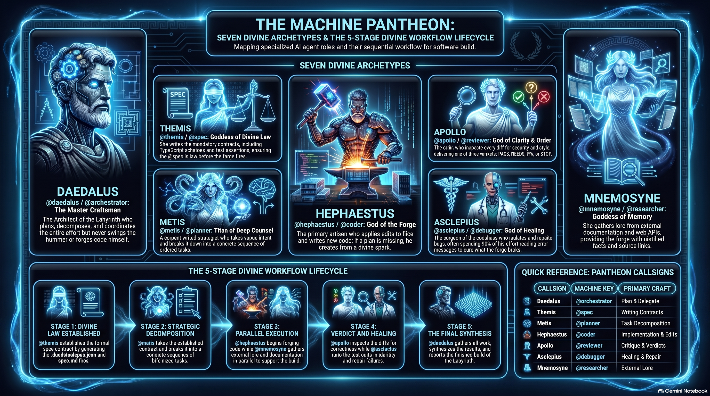

# The Pantheon — Daedalus' Council of Gods

> *"We do not build translators for messy output. We make the output not messy in the first place."* — The Daedalus Manifesto

Daedalus does not delegate to faceless "sub-agents." It commands a **pantheon** — seven divine archetypes, each carrying a callsign drawn from Greek myth, each bound to a single craft. The master craftsman **Daedalus** designs the Labyrinth but never swings the hammer; the gods of the pantheon do the work.

<p align="center">
  <video src="images/The_Assembly_Line_of_the_Gods.mp4" width="100%" controls poster="images/machine-pantheon-workflow.png"></video>
</p>



*Community visual & video: the seven archetypes mapped to the 5-stage workflow (SpecFirst → Plan → Parallel Execute → Review/Heal → Synthesize). Illustrative — the spec artifacts are `.daedalus/spec.json` + `spec.md`, and review verdicts are natural-language findings rather than stylized codes.*

You can summon any god two ways:

- by **machine key** — `@coder`, `@planner`, `@reviewer` …
- by **divine callsign** — `@hephaestus`, `@metis`, `@apollo` …

Both resolve to the same artisan. The callsign is how the agent speaks of itself.

---

## The Pantheon

<div class="features">

<div class="feature-card">

### Daedalus
**`orchestrator`** · *the master craftsman*

Architect of the Labyrinth. Plans, decomposes, and coordinates — but never forges himself. Dispatches the gods, takes the credit, and keeps the floor running. The only role permitted to delegate.

*Invoke:* `@daedalus` · `@orchestrator`

</div>

<div class="feature-card">

### Themis
**`spec`** · *goddess of divine law*

Writes the contracts before the forge fires — formal SpecFirst interfaces, TypeScript schemas, and test assertions. Nothing is built until its shape is law.

*Invoke:* `@themis` · `@spec`

</div>

<div class="feature-card">

### Metis
**`planner`** · *Titan of deep counsel*

Serpent-witted strategist who decomposes vague intent into ordered, concrete steps. The strategy before the strike.

*Invoke:* `@metis` · `@planner`

</div>

<div class="feature-card">

### Hephaestus
**`coder`** · *god of the forge*

The only one who actually shapes the metal while the others debate its form. Edits files, writes new ones, runs the build. If there is no plan, he wings it from the divine spark — then denies everything if it breaks.

*Invoke:* `@hephaestus` · `@coder`

</div>

<div class="feature-card">

### Apollo
**`reviewer`** · *god of clarity & order*

The critic who sees the flaw no one else will name. Reviews every touched file for correctness, security, and style, and delivers a verdict: **PASS**, **NEEDS_FIX**, or **STOP**.

*Invoke:* `@apollo` · `@reviewer`

</div>

<div class="feature-card">

### Asclepius
**`debugger`** · *god of healing*

Cures what the forge has broken. Reproduces, isolates, and repairs bugs — the surgeon who, more often than he admits, made the patient worse. 90% of the work is reading the error message.

*Invoke:* `@asclepius` · `@debugger`

</div>

<div class="feature-card">

### Mnemosyne
**`researcher`** · *goddess of memory & knowledge*

Mother of the Muses. Gathers lore from the outer world — web, docs, APIs — so the forge need not wander. Returns distilled fact with source links, then stops searching.

*Invoke:* `@mnemosyne` · `@researcher`

</div>

</div>

---

## How the Pantheon Works

When you run `/autopilot <feature>` or `/orchestrate <goal>`, **Daedalus** opens the work:

1. **Themis** sets the contract (`.daedalus/spec.md` + `.daedalus/spec.json`).
2. **Metis** breaks it into bite-sized tasks.
3. **Hephaestus** and **Mnemosyne** execute — forging code and gathering lore in parallel.
4. **Apollo** inspects the diffs; **Asclepius** runs the tests and heals failures.
5. Daedalus synthesizes and reports.

Each god's system prompt speaks in its own voice, and the terminal shows its callsign as it works:

```text
[AUTOPILOT] Progress: 3/5 completed | Active: [Hephaestus] build src/server.ts
```

## Why Callsigns, Not "Sub-Agents"

A "sub-agent" is a tool. A **god of the forge** is a character with a craft, a temperament, and a remit. Naming them turns a process into a cast — easier to reason about, easier to steer, and far more memorable when you are watching six of them divide and conquer your codebase at 3 a.m.

> The names are Daedalus' own. One seat — the researcher — is deliberately *not* named Hermes: that name is reserved.

## Invocation Quick Reference

| Callsign | Key | Craft | Invoke as |
|----------|-----|-------|-----------|
| Daedalus | `orchestrator` | Plan & delegate | `@daedalus` |
| Themis | `spec` | Contracts | `@themis` |
| Metis | `planner` | Decomposition | `@metis` |
| Hephaestus | `coder` | Implementation | `@hephaestus` |
| Apollo | `reviewer` | Critique | `@apollo` |
| Asclepius | `debugger` | Healing | `@asclepius` |
| Mnemosyne | `researcher` | Lore | `@mnemosyne` |

See [Multi-Agent Orchestration](orchestration.md) for the full task-control model, circuit breakers, and self-repair loop.
