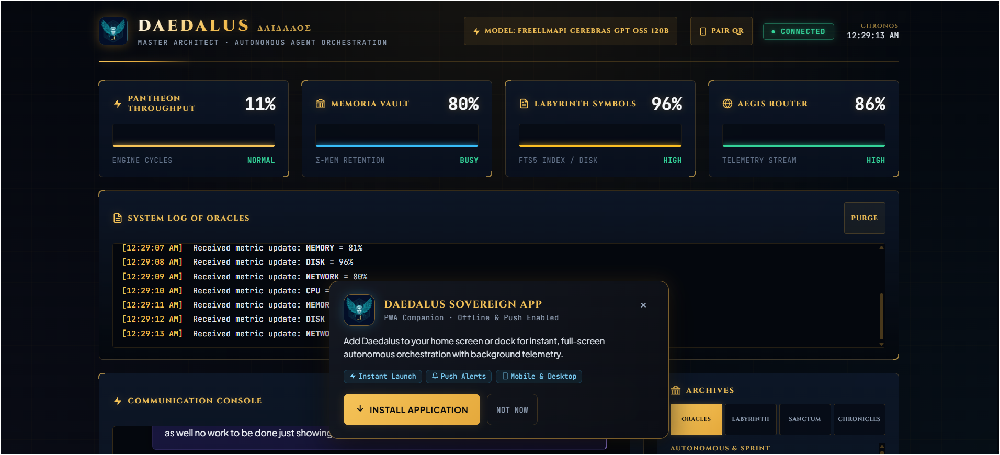
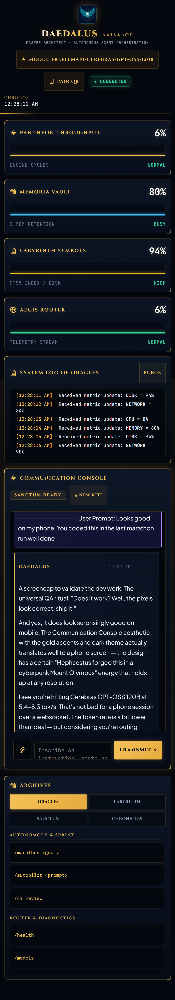
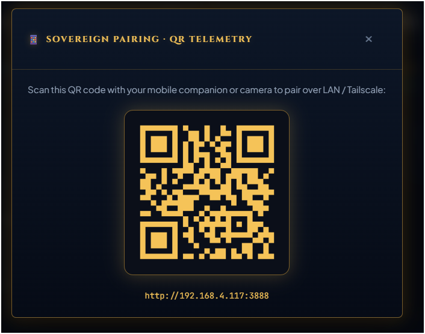

# Companion WebUI & Real-Time Chat Console

> *"The labyrinth is traversed not only through the terminal, but through the illuminated sanctum of the web companion."*

Daedalus includes a native, zero-dependency **Companion WebUI** (http://127.0.0.1:3888) powered by an embedded HTTP server and real-time Server-Sent Events (SSE). It gives you a visual dashboard to monitor telemetry, browse and switch models, manage historical sessions, inspect active context, attach multimodal artifacts, and interact with the agent loop in real time.

<p align="center">
  
  
</p>
<p align="center">
  <sub><b>Unified Cyber-Mythic Experience:</b> Desktop PWA Dashboard &amp; Sovereign Mobile Companion</sub>
</p>

---

## Quick Start

Launch the companion WebUI from inside any active Daedalus session:

`	ext
/webui open
`

This starts the local telemetry server on port 3888 (or auto-reclaims port conflicts) and automatically opens your default browser to http://localhost:3888.

### CLI WebUI Management Commands

| Command | Action |
|---------|--------|
| /webui or /webui open | Start the server (if not already running) and open the browser |
| /webui start | Start the HTTP server in the background without opening the browser |
| /webui status | Check connection status, active client count, and URL |
| /webui stop | Terminate the WebUI server and disconnect active clients |
| /webui rate <ms> | Set telemetry update interval in milliseconds (default: 1000, min: 100, max: 60000) |

---

## Visual Architecture & Dashboard Layout

The WebUI is crafted with an ancient Greek mythic dark-mode aesthetic, divided into three coordinated operational zones:

### 1. The Oracle Header
* **Seal of Daedalus & Title Crest**: Reflects system state and branding.
* **Active Model & Tier Badge (#active-model-badge)**: Shows the current routing model (e.g. MODEL: AUTO, MODEL: CLAUDE-3-5-SONNET). Clicking opens the **Router Oracles** modal.
* **Connection Status Pill**: Live SSE status indicator (● CONNECTED, ● RECONNECTING).
* **Chronos Clock**: Live server-synchronized timestamp.

### 2. The Four Oracle Telemetry Cards
* **⚡ PANTHEON THROUGHPUT**: Real-time CPU cycle utilization and engine throughput sparkline.
* **🏛️ MEMORIA VAULT**: RAM memory consumption and Σ-Mem retention metric.
* **📜 LABYRINTH SYMBOLS**: FTS5 symbol index cache & disk storage utilization.
* **🌐 AEGIS ROUTER**: Real-time network throughput and SSE telemetry streaming heartbeat.

### 3. Communication Console & Archives Sidebar
* **Communication Console**: Real-time conversational agent feed, interactive tool accordions, code syntax highlighter, and auto-expanding input prompt.
* **Archives Sidebar**: Four multi-tab panes for quick command execution, project file tree navigation, active context token management, and historical session resumption.

---

## Core Feature Breakdown

### 1. Real-Time Token Streaming
Responses stream token-by-token over Server-Sent Events (chat_token). You see Daedalus reason, draft code, and stream responses in real-time with zero buffering delay.

### 2. Chronicles (Saved Sessions Sidebar)
The **CHRONICLES** tab in the sidebar connects directly to SQLite session persistence (/api/sessions):
* **Browse Sessions**: Lists past conversations for the active project with creation timestamps and turn counts.
* **One-Click Resumption (RESUME)**: Instantly restore historical context, active files, and conversation memory.
* **Session Deletion (DEL)**: Cleanly delete old session archives.
* **Fresh Sessions (+ NEW)**: Initialize a brand-new turn context on demand.

### 3. Active Model Switcher Modal
Click the **MODEL: ...** pill in the top header to summon the **Router Oracles** modal (/api/models):
* Switch between **Auto / Smart Router** (dynamic task-complexity routing) and explicit tiers:
  * **Speed Tier**: Low-latency lightweight models for fast lookups.
  * **Intelligence Tier**: Frontier reasoning models for architectural refactors.
  * **Economy Tier**: Cost-effective models for bulk processing.
  * **Local / Ollama**: Fully offline local models.
* Instantly updates the CLI router configuration without restarting the session.

### 4. In-Chat Collapsible Tool Accordions
When Daedalus invokes tools (
ead_file, write_file, patch, 	erminal, lsp_query, web_search), an interactive tool accordion renders directly inside the chat feed:
* Displays live state badge (RUNNING ➔ COMPLETED).
* Click any tool accordion header to toggle open/closed and inspect execution arguments and outputs.

### 5. Code Blocks with Syntax Highlighting & "COPY CODE"
Markdown code blocks automatically render with:
* Language identifier pill (TYPESCRIPT, PYTHON, RUST, BASH, JSON, etc.).
* Syntax-highlighted keywords, strings, numbers, booleans, and comments.
* A hover **COPY CODE** button that copies clean raw code to your clipboard with temporary COPIED! feedback.

### 6. Auto-Expanding Multi-Line Input
The console input features a flexible <textarea> designed for coding workflows:
* Grows dynamically as you type (up to 180px).
* Press **Shift + Enter** to insert newlines for long multi-line instructions or code snippets.
* Press **Enter** to immediately transmit the instruction.
* Press **Escape** to clear the current draft.
* Press **↑ / ↓** to navigate your local prompt history.

### 7. Multimodal Artifacts & Image Paste
Offer visual artifacts directly to the agent:
* **Clipboard Paste (Ctrl + V)**: Paste screenshots or images directly from your clipboard.
* **Drag-and-Drop**: Drag images or code files directly over the communication console.
* **Attachment Button (📎)**: Select image or code files from your disk.
* Images are rendered as inline previews and transmitted as base64 payloads to vision-enabled models.

### 8. ✦ NEW RITE Console Reset
Located in the communication console header, the **✦ NEW RITE** button lets you wipe the visual console and spawn a clean session in one click.

### 9. Labyrinth Interactive File Tree
The **LABYRINTH** tab displays an interactive directory tree of your project:
* Ignores .gitignore, 
ode_modules, dist, and binary build artifacts.
* Expand and collapse directories with folder arrows.
* Click any file to instantly insert its relative path into the prompt textarea.

### 10. Sanctum Active Context Manager
The **SANCTUM** tab lists all files currently held in the agent's turn context:
* Click a file name to insert its reference into the prompt.
* Click the **×** button to remove a file from active turn context, saving context window tokens.

### 11. Sovereign Mobile PWA Companion
The WebUI is engineered as a fully installable, mobile-first **Progressive Web App (PWA)**:
* **Standalone Window**: Runs with a native app title bar, custom gold theme icon (`/favicon.svg`), and dark background (`#0f172a`).
* **Offline Shell**: Powered by a service worker (`sw.js`) that precaches core application assets, ensuring instant cold starts even on intermittent networks.
* **Fluid Mobile Reflow**: Dedicated `@media (max-width: 600px)` rules stack telemetry cards and the archives sidebar cleanly without horizontal overflow down to 375px screens.
* **Tactile Touch Targets**: All buttons, pills, and interactive links meet minimum 48px tap targets with `pointerdown` tactile response.

### 12. Remote LAN & Tailscale Pairing via QR Code
Pair your mobile phone or tablet with your host development workstation in seconds:
1. Click the **PAIR QR** pill in the WebUI header.
2. The modal generates a real-time QR code (`GET /api/qr`) encoding your workstation's local network or Tailscale WebSocket endpoint.
3. Scan the QR code with your phone camera or tablet browser to open the sovereign mobile console.

<p align="center">
  
</p>

### 13. Live Milestone Push Notifications
Never miss an autonomous milestone completion:
* When running `/marathon` or `/autopilot`, the host broadcasts milestone progress events over the dedicated WebSocket server (`ws.ts`).
* The WebUI client requests notification permissions on arrival and dispatches native OS push notifications with Apollo evaluation scores and milestone summaries.

---

## Mobile PWA Installation Guide

### iOS (Safari)
1. Open the WebUI URL in Safari on your iPhone or iPad.
2. Tap the **Share** button (the square with an arrow pointing up).
3. Scroll down and tap **Add to Home Screen**.
4. Name the app **Daedalus** and tap **Add**.
5. Launch Daedalus directly from your Home Screen in full-screen standalone mode.

### Android (Chrome / Edge / Brave)
1. Open the WebUI URL in your mobile browser.
2. An **INSTALL DAEDALUS** banner will automatically appear at the bottom of the screen.
3. Tap **INSTALL** (or open the browser menu and select **Install app** / **Add to Home screen**).
4. Daedalus will install as a native application in your app drawer.

---

## Live Testing & Remote Pairing Walkthrough

### 1. Start the Server on your Host Machine
Inside your Daedalus REPL, run:
```text
/webui start
```
Or start and open directly in your desktop browser:
```text
/webui open
```

### 2. Pair Your Mobile Device
1. On your desktop WebUI, click the **📱 PAIR QR** button in the top header.
2. Point your phone's camera at the QR code on your screen and tap the detected link.
3. Your mobile browser opens the Daedalus companion console instantly over Wi-Fi or Tailscale.

### 3. Test Push Notifications
1. In your desktop CLI or WebUI, run an autonomous task:
   ```text
   /autopilot Add a health check endpoint to src/webui/server.ts
   ```
2. As Hephaestus completes code and Apollo approves the milestone, your mobile device receives a native push notification with the live milestone score!

---

## Keyboard Shortcuts

| Shortcut | Function |
|----------|----------|
| Enter | Transmit prompt to Daedalus |
| Shift + Enter | Insert newline in multi-line prompt |
| Ctrl + V | Paste image or text artifact from clipboard |
| Escape | Clear input box |
| ↑ (at start of input) | Recall previous prompt from history |
| ↓ | Recall next prompt from history |

---

## REST & Streaming API Reference

The WebUI communicates with the local Daedalus server via lightweight JSON endpoints and SSE:

### Telemetry & Real-Time Stream
* **GET /telemetry** — Server-Sent Events stream emitting connected, chat_token, chat_tool_start, chat_tool_result, chat_done, chat_error, and system telemetry metrics (cpu, memory, disk, 
etwork).

### Chat & History
* **POST /api/chat** — Transmits { message: string, imageBase64?: string } to the active Daedalus REPL agent loop.
* **GET /api/history** — Returns current session chat message history [{ role, text, timestamp }].

### Project & Context Files
* **GET /api/files** — Returns project root name and recursive file tree JSON.
* **GET /api/context** — Returns array of active files in turn context { files: string[] }.
* **DELETE /api/context** — Removes file from active context { file: string }.

### Session Management (Chronicles)
* **GET /api/sessions** — Returns all saved sessions { sessions: SessionItem[] }.
* **POST /api/sessions/resume** — Resumes a session by ID { sessionId: string }.
* **POST /api/sessions/new** — Creates and starts a clean session.
* **DELETE /api/sessions** — Deletes a saved session by ID { sessionId: string }.

### Model Routing & Selection
* **GET /api/models** — Returns { activeModel: string, availableModels: ModelItem[] }.
* **POST /api/models/switch** — Switches active routing engine { model: string }.
